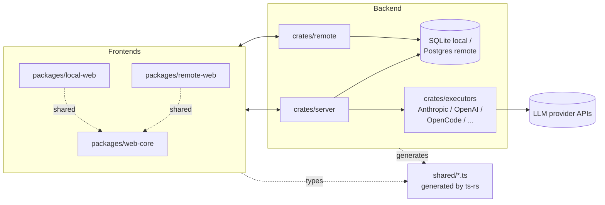

---
mb_meta:
  projectID: "vibe-kanban-fork"
  version: "0.1.0"
  lastUpdated: "2026-05-05"
  templateVersion: "1.0"
  fileType: "systemPatterns"
---

# Vibe Kanban (ciekawy fork) - System Patterns & Architecture

## Overall Architecture
### System Architecture Pattern
**Pattern**: Rust workspace backend (axum + SQLx) with React/TS frontends sharing generated
TS types via ts-rs; pluggable LLM executors per provider; optional remote/cloud deployment
via `crates/remote` (Postgres + ElectricSQL).
**Rationale**: Inherited from upstream Vibe Kanban; the fork preserves this architecture to
keep upstream merges low-friction. New work follows existing patterns rather than introducing
new ones.

### High-Level System Diagram

### Key Architectural Principles
- Stay close to upstream architecture so periodic merges from `BloopAI/vibe-kanban` remain
  low-conflict.
- Cross-language type safety via ts-rs: never hand-edit `shared/types.ts` or
  `shared/remote-types.ts`.
- Per-executor isolation: new model support belongs in the corresponding executor crate
  plus the model-config UI; avoid leaking provider specifics elsewhere.

## Component Architecture
### Core Components
#### crates/server
- **Purpose**: Local backend HTTP API and process orchestration for executors.
- **Responsibilities**: route handlers, executor lifecycle, MCP, stream relays, sessions.
- **Dependencies**: db, executors, services, utils, git, api-types.

#### crates/executors
- **Purpose**: Per-provider LLM executor implementations (Anthropic, OpenAI, OpenCode, ...).
- **Responsibilities**: model selection, request shaping, streaming response handling
  (including extended-thinking / CoT streams), tool-use plumbing.
- **Dependencies**: utils, services, api-types.

#### crates/remote
- **Purpose**: Cloud/remote deployment (Postgres + ElectricSQL); separate API surface.
- **Responsibilities**: multi-tenant org/project management, audit logging (OTLP),
  remote-specific routes including `/v1/projects` and `/v1/organizations`.
- **Dependencies**: db, services, utils, api-types; see `crates/remote/AGENTS.md`.

#### packages/web-core
- **Purpose**: Shared React/TS components used by both local and remote frontends.
- **Responsibilities**: kanban UI, project/org UI (UI-side of upstream sunset that the
  fork has reverted via VIB-51 work), executor/model-config UI, streaming/CoT renderer.
- **Dependencies**: generated types from `shared/`.

### Component Relationships
Frontends depend on `web-core`; backends own `shared/` type generation. Adding a new model
typically touches: an executor crate (Rust), the model-config UI (web-core), possibly the
shared types, and tests in both layers.

## Design Patterns in Use
### Primary Patterns
#### Code-generated cross-language types (ts-rs)
- **Usage**: All Rust types exposed to the frontend are generated, not hand-written.
- **Benefits**: One source of truth; refactors in Rust force frontend updates.
- **Implementation**: `crates/server/src/bin/generate_types.rs` and
  `crates/remote/src/bin/remote-generate-types.rs`; run via `pnpm run generate-types` /
  `pnpm run remote:generate-types`.

#### Per-provider executor crates with shared trait surface
- **Usage**: Each LLM provider lives in its own module under `crates/executors/`.
- **Benefits**: Provider-specific quirks (e.g., extended thinking, 1M-context handling)
  remain isolated; new providers can be added without touching siblings.
- **Implementation**: see existing executors as templates.

### Supporting Patterns
- Workspace + worktree pattern (Vibe Kanban native): each in-flight task gets its own git
  worktree under `/var/tmp/vibe-kanban/worktrees/<slug>/` so multiple agents can work in
  parallel. This very HoliCode bootstrap session runs in such a worktree.
- Conventional commits for revert/rebase-friendly history (critical because the fork keeps
  merging from upstream).

## Data Architecture
### Data Flow Pattern
Frontend issues HTTP/SSE calls -> backend resolves session/executor -> executor streams
tokens (and, for newer models, separate extended-thinking deltas) -> backend relays to
frontend -> web-core renders thinking + final output blocks.

### Data Storage Strategy
- **Primary Data Store**: SQLite (local), Postgres (remote/cloud).
- **Caching Layer**: in-process only.
- **Data Persistence**: SQLx migrations under `crates/db/`.

### Data Models
#### Issue / Project / Workspace (Vibe Kanban native)
Modeled in `crates/db`; exposed via VK MCP server. The fork dogfoods this for HoliCode
ticket records once a VK project is linked.

#### Executor Session / Stream
Streaming sessions per executor; extended-thinking deltas need first-class modeling for the
new Claude Opus 4.7 + 1M context support and to render consistently with default models in
the UI.

## Integration Patterns
### External Service Integration
- **Anthropic**: streaming API, including extended-thinking deltas; 1M-context tier.
- **OpenAI**: streaming API; GPT 5.5 and prior families.
- **OpenCode**: external runtime; treat as another executor surface.

### API Design Patterns
- **API Style**: REST + SSE for streaming; MCP for agent integration.
- **Authentication**: trusted-key auth for remote (`crates/trusted-key-auth`); local server
  is local-trust.
- **Error Handling**: structured error responses; remote logs request context for 5xx
  (per upstream commit `91a2353c2`).

## Key Technical Decisions
### Decision 1: Use Vibe Kanban itself as the issue tracker for this fork
- **Decision**: Set `issue_tracker: vibe_kanban` and use the VK MCP server for ticket
  records; keep detailed specs/TDs in `.holicode/specs/**`.
- **Rationale**: Dogfooding — this project is Vibe Kanban; it would be strange to use
  another tracker.
- **Alternatives Considered**: GitHub Issues (rejected: less integrated with the agent
  workflows already running here).
- **Trade-offs**: Until a VK project is created/linked for the fork, ticket IDs are
  placeholders (`VIB-?`); first orchestration session will mint real IDs.

### Decision 2: Keep self-hosted projects/organizations UI alive on the fork
- **Decision**: Maintain the revert of upstream commit `97123d526` (UI sunset) on the fork.
- **Rationale**: Backend still supports `/v1/projects` and `/v1/organizations`; removing
  only the UI hurts self-hosted users for no upside on this fork.
- **Alternatives Considered**: Accept the sunset (rejected: kills primary self-hosted use).
- **Trade-offs**: Each upstream merge that touches `ProjectKanban.tsx`/`LocalProjectKanban.tsx`
  will need re-application of the revert.

### Decision 3: Own release pipeline under user's scope
- **Decision**: Publish npm CLI, GitHub Releases, and Docker images under `ciekawy` scope.
- **Rationale**: Independent cadence; not blocked on upstream publishing.
- **Alternatives Considered**: Continue consuming upstream artifacts (rejected: upstream
  is on hold/dying).
- **Trade-offs**: Need to maintain own publishing secrets and GHA workflows; small initial
  effort, ongoing maintenance is light.

## Quality Attributes
### Performance Requirements
- New-model streaming (incl. extended thinking) must not regress current per-token latency.
- 1M context handling must not block UI on large prompt construction.

### Security Requirements
- LLM API keys never logged or persisted to repo.
- Trusted-key auth maintained for remote deployments.

### Scalability Requirements
- Local server scales per-user; remote scales per-tenant via `crates/remote`.

### Maintainability Requirements
- Patches must remain revert/rebase-friendly to keep upstream merges painless.
- Generated types are never hand-edited.

## Anti-Patterns to Avoid
- Hand-editing `shared/types.ts` or `shared/remote-types.ts`: will be overwritten on next
  generation, drifts from Rust source of truth.
- Sprawling refactors that touch many crates at once: makes upstream merges brutal.
- Embedding provider-specific logic outside of the corresponding executor crate.
