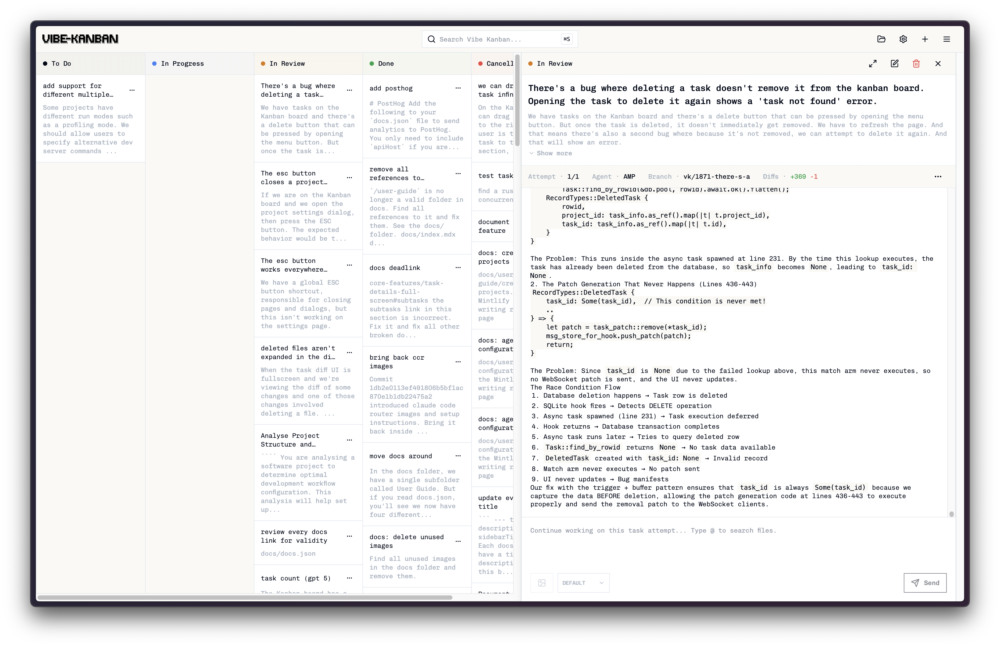

<p align="center">
  <a href="https://vibekanban.com">
    <picture>
      <source srcset="frontend/public/vibe-kanban-logo-dark.svg" media="(prefers-color-scheme: dark)">
      <source srcset="frontend/public/vibe-kanban-logo.svg" media="(prefers-color-scheme: light)">
      
    </picture>
  </a>
</p>

<p align="center">Claude Code、Gemini CLI、Codex、Ampなどのコーディングエージェントの生産性を10倍に...</p>
<p align="center">
  <a href="https://www.npmjs.com/package/vibe-kanban"></a>
  <a href="https://github.com/BloopAI/vibe-kanban/blob/main/.github/workflows/publish.yml"></a>
  <a href="https://deepwiki.com/BloopAI/vibe-kanban"></a>
</p>

<h1 align="center">
  <a href="https://jobs.polymer.co/vibe-kanban?source=github"><strong>採用募集中！</strong></a>
</h1>



## 概要

AIコーディングエージェントが世界のコードをますます書くようになり、人間のエンジニアは現在、計画、レビュー、タスクのオーケストレーションに大部分の時間を費やしています。Vibe Kanbanはこのプロセスを効率化し、以下を可能にします：

- 異なるコーディングエージェント間の簡単な切り替え
- 複数のコーディングエージェントの並列または順次実行のオーケストレーション
- 作業のクイックレビューと開発サーバーの起動
- コーディングエージェントが作業中のタスクステータスの追跡
- コーディングエージェントMCP設定の一元管理
- Vibe Kanbanをリモートサーバーで実行している場合のSSH経由でのプロジェクトのリモートオープン

動画の概要は[こちら](https://youtu.be/TFT3KnZOOAk)でご覧いただけます。

## インストール

お気に入りのコーディングエージェントで認証が完了していることを確認してください。サポートされているコーディングエージェントの完全なリストは[ドキュメント](https://vibekanban.com/docs)でご確認いただけます。ターミナルで以下を実行してください：

```bash
npx vibe-kanban
```

## ドキュメント

最新のドキュメントとユーザーガイドは[ウェブサイト](https://vibekanban.com/docs)をご覧ください。

## サポート

機能リクエストには[GitHub Discussions](https://github.com/BloopAI/vibe-kanban/discussions)を使用しています。機能リクエストを作成するにはディスカッションを開いてください。バグについてはこのリポジトリでissueを開いてください。

## コントリビューション

アイデアや変更は、まず[GitHub Discussions](https://github.com/BloopAI/vibe-kanban/discussions)または[Discord](https://discord.gg/AC4nwVtJM3)を通じてコアチームに提案していただくことをお勧めします。そこで実装の詳細と既存のロードマップとの整合性について議論できます。チームとの事前の議論なしにPRを開かないでください。

## 開発

### 前提条件

- [Rust](https://rustup.rs/)（最新の安定版）
- [Node.js](https://nodejs.org/)（18以上）
- [pnpm](https://pnpm.io/)（8以上）

追加の開発ツール：
```bash
cargo install cargo-watch
cargo install sqlx-cli
```

依存関係のインストール：
```bash
pnpm i
```

### 開発サーバーの実行

```bash
pnpm run dev
```

これによりバックエンドが起動します。空のDBが`dev_assets_seed`フォルダからコピーされます。

### フロントエンドのビルド

フロントエンドのみをビルドする場合：

```bash
cd frontend
pnpm build
```

### ソースからのビルド

1. `build-npm-package.sh`を実行
2. `npx-cli`フォルダで`npm pack`を実行
3. `npx [生成されたファイル].tgz`でビルドを実行できます


### 環境変数

以下の環境変数はビルド時またはランタイムに設定できます：

| 変数 | タイプ | デフォルト | 説明 |
|----------|------|---------|-------------|
| `POSTHOG_API_KEY` | ビルド時 | 空 | PostHogアナリティクスAPIキー（空の場合アナリティクスは無効） |
| `POSTHOG_API_ENDPOINT` | ビルド時 | 空 | PostHogアナリティクスエンドポイント（空の場合アナリティクスは無効） |
| `PORT` | ランタイム | 自動割り当て | **本番**：サーバーポート。**開発**：フロントエンドポート（バックエンドはPORT+1を使用） |
| `BACKEND_PORT` | ランタイム | `0`（自動割り当て） | バックエンドサーバーポート（開発モードのみ、PORT+1を上書き） |
| `FRONTEND_PORT` | ランタイム | `3000` | フロントエンド開発サーバーポート（開発モードのみ、PORTを上書き） |
| `HOST` | ランタイム | `127.0.0.1` | バックエンドサーバーホスト |
| `DISABLE_WORKTREE_ORPHAN_CLEANUP` | ランタイム | 未設定 | gitワークツリーのクリーンアップを無効化（デバッグ用） |

**ビルド時変数**は`pnpm run build`実行時に設定する必要があります。**ランタイム変数**はアプリケーション起動時に読み込まれます。

### リモートデプロイメント

Vibe Kanbanをリモートサーバー（例：systemctl、Docker、クラウドホスティング経由）で実行する場合、SSH経由でプロジェクトを開くようにエディタを設定できます：

1. **トンネル経由でアクセス**：Cloudflare Tunnel、ngrok、または類似のサービスを使用してWeb UIを公開
2. 設定 → エディタ統合で**リモートSSH設定**を構成：
   - **リモートSSHホスト**にサーバーのホスト名またはIPを設定
   - **リモートSSHユーザー**にSSHユーザー名を設定（オプション）
3. **前提条件**：
   - ローカルマシンからリモートサーバーへのSSHアクセス
   - SSHキーの設定（パスワードなし認証）
   - VSCode Remote-SSH拡張機能

設定完了後、「VSCodeで開く」ボタンは`vscode://vscode-remote/ssh-remote+user@host/path`のようなURLを生成し、ローカルエディタを開いてリモートサーバーに接続します。

詳細なセットアップ手順は[ドキュメント](https://vibekanban.com/docs/configuration-customisation/global-settings#remote-ssh-configuration)をご覧ください。
