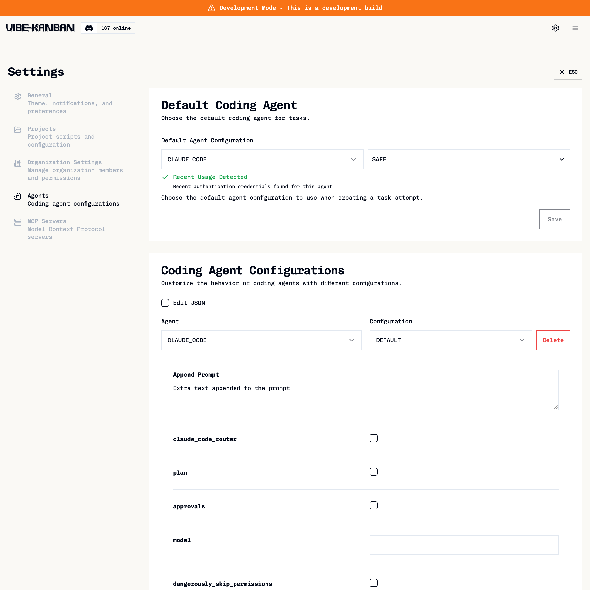

<p align="center">
  <a href="https://vibekanban.com">
    <picture>
      <source srcset="frontend/public/vibe-kanban-logo-dark.svg" media="(prefers-color-scheme: dark)">
      <source srcset="frontend/public/vibe-kanban-logo.svg" media="(prefers-color-scheme: light)">
      
    </picture>
  </a>
</p>

<p align="center">Get 10X more out of Claude Code, Gemini CLI, Codex, Amp and other coding agents...</p>

> **This is a fork of [BloopAI/vibe-kanban](https://github.com/BloopAI/vibe-kanban)** with additional enhancements for Claude Code settings configuration.
>
> For installation, documentation, and general usage, see the [original README](https://github.com/BloopAI/vibe-kanban#readme).

## Fork Enhancements

This fork adds the following features for Claude Code:

### LOCAL Profile

Import settings from your `~/.claude/settings.json` automatically:

```json
{
  "CLAUDE_CODE": {
    "LOCAL": {
      "CLAUDE_CODE": {
        "dangerously_skip_permissions": true,
        "use_local_settings": true
      }
    }
  }
}
```

- Profile settings take precedence over local settings
- Deny lists are **combined** from both sources

### Settings Configuration

Configure permissions and deny rules directly in profiles via **Settings → Agents**:

<p align="center">
  
</p>

Or edit the JSON directly:

```json
{
  "CLAUDE_CODE": {
    "SAFE": {
      "CLAUDE_CODE": {
        "settings": {
          "permissions": {
            "allowedTools": ["Read", "Glob", "Grep"],
            "deny": ["Bash(rm *)", "Read(.env*)"]
          }
        }
      }
    }
  }
}
```

Settings are written to `.claude/settings.local.json` in the workspace when the agent starts.

## Quick Start

### Prerequisites

- **Node.js** (v18+) and **pnpm**
- **Rust** via [rustup](https://rustup.rs/):
  ```bash
  curl --proto '=https' --tlsv1.2 -sSf https://sh.rustup.rs | sh
  source "$HOME/.cargo/env"
  cargo install cargo-watch
  ```

### Install & Run

```bash
git clone https://github.com/hippogriff-ai/vibe-kanban.git
cd vibe-kanban
pnpm i
pnpm run dev
```

This starts both the frontend (port 3000) and backend with auto-assigned ports.

> **Note: First run takes 3-5 minutes** to compile the Rust backend. Subsequent runs start in seconds (Rust only recompiles changed code).
>
> The original `npx vibe-kanban` is fast because it ships pre-built binaries. Running from source requires compilation but gives you access to fork enhancements and local modifications.

### Shell Alias (Optional)

Add to your `~/.zshrc` or `~/.bashrc` for quick access:

```bash
alias vk="cd ~/path/to/vibe-kanban && pnpm run dev"
```

Then reload your shell (`source ~/.zshrc`) and run `vk` from anywhere.

See the [original repo](https://github.com/BloopAI/vibe-kanban#development) for full development instructions.
