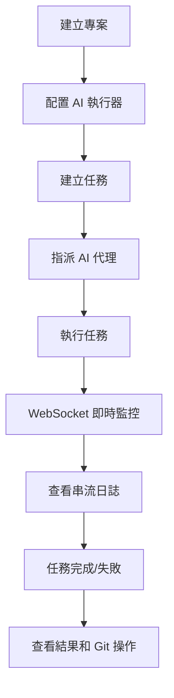

# Vibe Kanban 使用說明書 (繁體中文版)

## 目錄

1. [專案介紹](#專案介紹)
2. [系統需求與安裝](#系統需求與安裝)
3. [快速開始](#快速開始)
4. [專案管理](#專案管理)
5. [任務管理](#任務管理)
6. [AI 執行器配置](#ai-執行器配置)
7. [GitHub 整合](#github-整合)
8. [即時監控](#即時監控)
9. [高級功能](#高級功能)
10. [故障排除](#故障排除)
11. [最佳實踐](#最佳實踐)

---

## 專案介紹

Vibe Kanban 是一個創新的 AI 程式碼開發協調平台，提供多 AI 代理統一管理、視覺化任務追蹤，以及企業級工作流程自動化功能。

### 核心特色

```yaml
技術架構:
  - 後端: Rust + Axum + SQLite
  - 前端: React 18 + TypeScript + Vite
  - 即時通訊: WebSocket 串流
  - 版本控制: Git worktree 管理

AI 代理支援:
  - Claude Code (Anthropic)
  - Gemini CLI (Google)
  - Amp 編程助手
  - 開發服務器管理
  - 自定義執行器支援

企業功能:
  - GitHub OAuth 身份驗證
  - 專案隔離和權限管理
  - 即時任務狀態監控
  - 詳細執行日誌追蹤
  - Model Context Protocol (MCP) 服務器
```

### 應用場景

- **多 AI 工具整合**: 統一管理不同 AI 程式碼助手
- **團隊協作開發**: 視覺化任務分配和進度追蹤  
- **企業級工作流程**: 自動化程式碼審查、測試、部署
- **程式碼品質管控**: AI 驅動的程式碼審查和優化

---

## 系統需求與安裝

### 基礎需求

```yaml
軟體需求:
  - Node.js: ≥ 18.0.0
  - Rust: ≥ 1.70.0 (Nightly 2025-05-18+)
  - Git: ≥ 2.30.0
  - pnpm: ≥ 8.0.0

硬體需求:
  - 記憶體: ≥ 4GB RAM
  - 磁碟空間: ≥ 2GB
  - 網路: 穩定的網際網路連線

作業系統:
  - macOS 10.15+
  - Linux (Ubuntu 20.04+)
  - Windows 10+ (WSL2 建議)
```

### 快速安裝

```bash
# 方法一: NPX 安裝 (推薦)
npx vibe-kanban

# 方法二: 從源碼安裝
git clone https://github.com/BloopAI/vibe-kanban.git
cd vibe-kanban
pnpm install
pnpm dev
```

### 環境配置

```bash
# 安裝 Rust Nightly 工具鏈
rustup install nightly-2025-05-18
rustup default nightly-2025-05-18

# 建立環境變數檔案
cp .env.example .env

# 編輯環境變數
vim .env
```

**必要環境變數**:
```env
# GitHub OAuth (可選，用於 GitHub 整合)
GITHUB_CLIENT_ID=your_github_client_id
GITHUB_CLIENT_SECRET=your_github_client_secret

# PostHog 分析 (可選)
POSTHOG_API_KEY=your_posthog_key

# 資料庫設定 (自動建立)
DATABASE_URL=sqlite:./database.db

# 開發模式端口設定
FRONTEND_PORT=3000  # 前端端口
BACKEND_PORT=3001   # 後端 API 端口
```

---

## 快速開始

### 第一次啟動

1. **啟動開發服務器**
```bash
# 完整開發環境 (前端 + 後端)
pnpm dev

# 驗證程式碼品質 (必須執行)
pnpm run check

# 生成 TypeScript 類型定義
pnpm run generate-types
```

2. **存取應用程式**
- 前端界面: http://localhost:3000
- 後端 API: http://localhost:3001
- API 端點: http://localhost:3001/api/
- WebSocket 串流: ws://localhost:3001/api/stream/

3. **系統初始化**
- 首次啟動會自動建立 SQLite 資料庫
- 系統會建立預設的工作空間結構
- 自動遷移資料庫架構到最新版本

### 基本操作流程



---

*本使用說明書版本: v1.0.0*  
*適用於 Vibe Kanban 最新版本*  
*最後更新: 2025年7月26日*
EOF < /dev/null