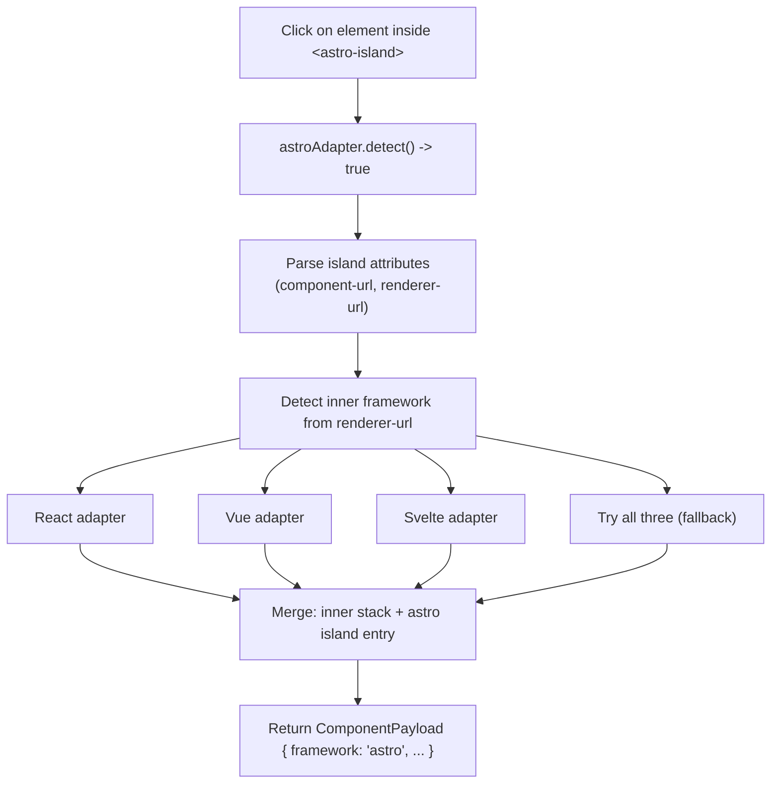

# Click-to-Component Architecture

## Table of Contents

1. [Overview](#1-overview)
2. [Adapter Architecture](#2-adapter-architecture)
3. [ComponentPayload Data Model](#3-componentpayload-data-model)
4. [React Adapter](#4-react-adapter)
5. [Vue Adapter](#5-vue-adapter)
6. [Svelte Adapter](#6-svelte-adapter)
7. [Astro Adapter](#7-astro-adapter)
8. [HTML Fallback](#8-html-fallback)
9. [Overlay and Inspect Mode UI](#9-overlay-and-inspect-mode-ui)
10. [PostMessage Protocol](#10-postmessage-protocol)
11. [Framework Detection Diagnostics](#11-framework-detection-diagnostics)
12. [Framework Comparison Table](#12-framework-comparison-table)
13. [File References](#13-file-references)

---

## 1. Overview

Click-to-Component is a runtime inspection feature built into Vibe Kanban's preview iframe. It lets users click any visible element in a live preview and instantly identify which framework component rendered it. The system extracts rich metadata about the clicked element: the component name, its source file path, line number, CSS class, and the full component hierarchy (stack). This information gets displayed as a structured badge inside the Lexical chat editor, then sent to the AI coding agent as structured JSON.

Think of it as browser DevTools' element inspector, but instead of showing raw DOM nodes, it shows you the *component-level* picture. Click a button, and you don't just see `<button class="btn-primary">`. You see `Button` from `src/components/Button.tsx` at line 42, nested inside `Toolbar > Header > App`.

The feature works across four major frontend frameworks (React, Vue, Svelte, Astro) plus a plain HTML fallback. Each framework has its own adapter that knows how to extract component information from framework-specific runtime internals. The adapters share a common interface and are registered in a priority-ordered list. When a user clicks an element, the system tries each adapter in order until one succeeds.

This document covers every layer of the system: the adapter pattern, each framework adapter's internals, the overlay UI, the postMessage protocol, and the diagnostic tooling.

---

## 2. Adapter Architecture

The entire Click-to-Component system lives in a single file: `click_to_component_script.js` (791 lines). The file is organized into clearly labeled sections that follow a top-down structure.

```
+---------------------------------------------------+
|            click_to_component_script.js            |
|                                                    |
|  +----------------------------------------------+ |
|  |  CORE: State & Utilities                      | |
|  |  - inspectModeActive flag                     | |
|  |  - send() postMessage helper                  | |
|  |  - getHTMLPreview() element snapshot           | |
|  +----------------------------------------------+ |
|                                                    |
|  +----------------------------------------------+ |
|  |  ADAPTER INTERFACE                            | |
|  |  {                                            | |
|  |    name: string,                              | |
|  |    detect: (el) -> boolean,                   | |
|  |    getComponentInfo: (el) -> Promise<Payload>,| |
|  |    getOverlayLabel?: (el) -> string | null    | |
|  |  }                                            | |
|  +----------------------------------------------+ |
|                                                    |
|  +----------+ +----------+ +----------+ +--------+ |
|  |  REACT   | |   VUE    | |  SVELTE  | | ASTRO  | |
|  |  ADAPTER  | |  ADAPTER  | |  ADAPTER  | | ADAPT. | |
|  +----------+ +----------+ +----------+ +--------+ |
|                                                    |
|  +----------------------------------------------+ |
|  |  HTML FALLBACK                                | |
|  +----------------------------------------------+ |
|                                                    |
|  +----------------------------------------------+ |
|  |  ADAPTER REGISTRY & DISPATCHER                | |
|  |  - adapters = [astro, react, vue, svelte]     | |
|  |  - getElementContext() -- first match wins    | |
|  |  - detectFrameworks() -- diagnostic           | |
|  +----------------------------------------------+ |
|                                                    |
|  +----------------------------------------------+ |
|  |  CORE: Overlay, Events & Initialization       | |
|  |  - createOverlay() / positionOverlay()        | |
|  |  - onClick() / onMouseOver()                  | |
|  |  - setInspectMode()                           | |
|  |  - message listener                           | |
|  +----------------------------------------------+ |
+---------------------------------------------------+
```

### The Adapter Interface

Every adapter implements the same contract:

```typescript
interface Adapter {
  name: string;
  detect: (element: HTMLElement) => boolean;
  getComponentInfo: (element: HTMLElement) => Promise<ComponentPayload | null>;
  getOverlayLabel?: (element: HTMLElement) => string | null;
}
```

- **`name`**: Human-readable identifier (`'react'`, `'vue'`, `'svelte'`, `'astro'`).
- **`detect(element)`**: Quick synchronous check. Returns `true` if this adapter can handle the given DOM element. Should be fast since it runs on every candidate.
- **`getComponentInfo(element)`**: The heavy lifter. Extracts full component metadata from the element. Returns a `ComponentPayload` or `null` if extraction fails despite detection succeeding.
- **`getOverlayLabel(element)`** *(optional)*: Returns a short string for the hover overlay label. If not provided, the system falls back to the component name from `getComponentInfo`.

### Registration Order

The adapter array is ordered deliberately:

```javascript
const adapters = [astroAdapter, reactAdapter, vueAdapter, svelteAdapter];
```

Astro comes first because `<astro-island>` elements wrap inner framework components. The Astro adapter needs first crack at these elements so it can delegate to the appropriate inner adapter (React, Vue, or Svelte) while still capturing the Astro island metadata.

The HTML fallback sits outside this array. It's a separate path invoked only when every adapter either fails detection or returns `null` from `getComponentInfo`.

### Dispatcher Logic

The `getElementContext()` function is the central dispatcher:

```
For each adapter in [astro, react, vue, svelte]:
    if adapter.detect(element) returns true:
        result = await adapter.getComponentInfo(element)
        if result is not null:
            return result
        else:
            fall through to HTML fallback

If no adapter matches:
    return HTML fallback result
```

This "first match wins" approach keeps things simple. An element either belongs to a framework or it doesn't. When an adapter detects an element but can't extract useful info (returns `null`), the system doesn't try the next adapter. It drops straight to the HTML fallback. This prevents confusing results where a React element might accidentally match a Vue heuristic.

---

## 3. ComponentPayload Data Model

Every adapter produces a `ComponentPayload` object. This is the canonical data structure that flows from the iframe to the parent window and eventually to the AI agent.

```typescript
interface ComponentPayload {
  framework: string;     // 'react' | 'vue' | 'svelte' | 'astro' | 'html'
  component: string;     // Component name: 'Button', 'UserProfile'
  tagName?: string;      // HTML tag: 'button', 'div'
  file?: string;         // File path: 'src/components/Button.tsx'
  line?: number;         // Line number (Svelte only, React with source maps)
  column?: number;       // Column number (Svelte only)
  cssClass?: string;     // First CSS class on the element
  stack?: Array<{        // Component hierarchy (innermost first)
    name: string;
    file?: string;
  }>;
  htmlPreview: string;   // HTML element snapshot (opening tag only)
}
```

A few things to note about this structure:

**`framework`** identifies which adapter produced the result. The AI agent uses this to understand what kind of project it's working with.

**`component`** is the display name. For React, it comes from the fiber tree. For Vue, from the component type's name property (with multiple fallbacks). For Svelte, it's extracted from the filename. For HTML fallback, it's just the tag name in uppercase.

**`stack`** represents the component hierarchy from innermost (the clicked component) to outermost (the root). Not all frameworks support this equally. React provides deep owner stacks, Vue walks the parent chain, Svelte gives only a single entry, and Astro merges inner framework stacks with the island wrapper.

**`htmlPreview`** is a sanitized snapshot of the element's opening tag. It gives the AI agent a quick look at the actual DOM output without needing to inspect the page.

**`line` and `column`** are only reliably available from Svelte (via `__svelte_meta`) and React (via source maps through VKBippy). Vue doesn't expose line numbers without a build plugin.

---

## 4. React Adapter

*Lines 78-244 in `click_to_component_script.js`*

The React adapter is the most complex of the four. It relies on VKBippy, a global object installed by `bippy_bundle.js` that hooks into React's internal fiber tree.

### Detection

```javascript
VKBippy.isInstrumentationActive() && VKBippy.getFiberFromHostInstance(element)
```

Both conditions must be true. `isInstrumentationActive()` confirms that VKBippy successfully patched React's internals. `getFiberFromHostInstance(element)` checks whether the specific DOM element has an associated React fiber node. If the page isn't a React app, or if VKBippy failed to initialize, detection returns `false` immediately.

VKBippy is injected into the preview iframe as a separate script (`bippy_bundle.js`), loaded right after the `<head>` tag. It patches React's reconciler to expose fiber tree access through a clean API.

### Component Info Extraction

The extraction process has two paths, depending on whether owner stack information is available:

1. **Get the fiber**: `VKBippy.getFiberFromHostInstance(element)` returns the fiber node for the DOM element.
2. **Try owner stack**: `VKBippy.getOwnerStack(fiber)` is an async call that returns source file locations with line and column numbers. If this succeeds and returns entries with source files, the adapter builds stack entries with `file:line:column` format.
3. **Fallback to fiber traversal**: If the owner stack is empty or unavailable, the adapter walks the fiber tree upward using `VKBippy.traverseFiber(fiber, callback, goUp=true)`. This collects component names but without file location data.

### Name Filtering

React's fiber tree contains many internal components that aren't useful to show. The adapter applies two layers of filtering:

**Framework internals lists:**
- `NEXT_INTERNAL`: Names like `InnerLayoutRouter`, `RedirectErrorBoundary`, `HotReload`, and other Next.js plumbing components.
- `REACT_INTERNAL`: Names like `Suspense`, `Fragment`, `StrictMode`, `Profiler`.

**Heuristic filters:**
- `isSourceComponentName(name)`: Rejects names starting with `_` (private/generated), names starting with a lowercase letter (HTML elements or hooks), names containing both `Provider` and `Context` (React context wrappers), and names starting with `Primitive.` (Radix UI primitives).
- `isUsefulComponentName(name)`: A less strict version used for overlay labels. Applies similar rules but with fewer exclusions.

These filters ensure the user sees meaningful component names like `UserProfile` or `ShoppingCart`, not `Suspense > InnerLayoutRouter > RedirectErrorBoundary`.

### Overlay Label

The `getNearestComponentName()` function walks the fiber's `.return` chain (parent pointers) to find the first component with a useful name. This provides the hover label shown during inspect mode, before the user clicks.

---

## 5. Vue Adapter

*Lines 246-355 in `click_to_component_script.js`*

### Detection

The `isVueElement(element)` function performs a two-step check:

1. **Global check**: `window.__VUE__` must exist. This global is set by Vue's dev mode runtime. If it's absent, the page either isn't using Vue or is running in production mode.
2. **DOM walk**: Starting from the clicked element, walk up the DOM tree (max 50 ancestors). At each node, check for `el.__VUE__` or `el.__vueParentComponent`. These properties are attached by Vue's runtime to elements that serve as component mount points.

The 50-ancestor limit prevents performance issues on deeply nested DOMs while still catching most real-world component hierarchies.

### Component Info Extraction

1. **Find Vue instance**: `findVueInstance(element)` walks up the DOM looking for `el.__VUE__[0]` (the first Vue app instance on the element) or `el.__vueParentComponent` (the parent component instance).

2. **Component name resolution** uses a four-level fallback chain:
   ```
   type.displayName || type.name || type.__name || extractNameFromFile(type.__file) || 'Anonymous'
   ```
   The `extractNameFromFile` function takes a path like `src/components/UserCard.vue` and extracts `UserCard`. This handles Single File Components (SFCs) where the component might not have an explicit name but does have a `__file` property in dev mode.

3. **File path**: Comes from `instance.type.__file`. Only available for SFC components compiled in development mode. Production builds strip this information.

4. **Stack building**: The adapter walks `instance.parent` up to 20 levels, collecting `{ name, file }` for each component that isn't `'Anonymous'`. This produces a meaningful hierarchy like `UserCard > UserList > Dashboard > App`.

### Limitations

Vue's runtime doesn't expose line numbers. Getting line-level precision would require a build plugin like `unplugin-vue-source`, which isn't something the Click-to-Component system can inject at runtime.

The `__VUE__` global only exists in development mode. Production Vue apps strip all debug metadata, making component detection impossible.

Nuxt 3 and Nuxt 4 applications work identically since they use the same Vue 3 internals under the hood. The adapter has been tested with Vue 3.3, 3.4, and 3.5.

---

## 6. Svelte Adapter

*Lines 357-462 in `click_to_component_script.js`*

### Detection

`findSvelteMeta(element)` walks up the DOM (max 50 ancestors) looking for any element with a `__svelte_meta` property. This property is attached by the Svelte compiler in development mode and contains source location information.

### Component Info Extraction

1. **Source location**: `element.__svelte_meta.loc` provides `{ file, line, column }`. This is the most precise source mapping of any framework adapter, giving exact file, line, and column without needing source maps or build plugins.

2. **Component name**: Extracted from the file path. `'src/lib/Button.svelte'` becomes `'Button'`. The adapter strips the directory path and the `.svelte` extension.

3. **CSS class**: The adapter picks the first CSS class that doesn't match the `svelte-*` pattern. Svelte generates scoped CSS classes like `svelte-1a2b3c` (hash-based), and these aren't useful for identification. The first non-hash class is typically the one the developer wrote.

4. **Stack**: Always a single entry. Svelte's runtime doesn't expose a parent component chain the way React and Vue do. You get the immediate component, nothing more.

5. **File location format**: The file field includes line and column: `'src/lib/Button.svelte:42:3'`. This gives the AI agent everything it needs to jump directly to the right spot in the source.

### The Svelte 5 Problem

Svelte is the only framework that provides line and column numbers without any build plugin. But there's a catch.

Svelte 5 with runes mode deliberately removed the `__svelte_meta` property (tracked in Svelte issue #11389). The Svelte team decided that exposing compiler metadata at runtime was an implementation detail that shouldn't be relied upon. This means the adapter works with Svelte 4 and Svelte 5 in legacy mode, but it's impossible to detect components in Svelte 5 runes mode. There's no workaround. The metadata simply doesn't exist at runtime.

---

## 7. Astro Adapter

*Lines 464-597 in `click_to_component_script.js`*

The Astro adapter is unique because Astro is a meta-framework. It doesn't render components itself. Instead, it wraps components from other frameworks (React, Vue, Svelte) inside `<astro-island>` custom elements. The adapter's job is to identify the island, extract Astro-level metadata, then delegate to the appropriate inner framework adapter.

### Detection

```javascript
element.closest('astro-island')
```

Simple and effective. If the clicked element is inside an `<astro-island>` custom element, the Astro adapter handles it.

### Component Info Extraction

1. **Get the island**: `element.closest('astro-island')` returns the wrapping custom element.

2. **Parse island attributes**:
   - `component-url`: The source path, e.g., `/src/components/Counter.jsx`
   - `component-export`: Usually `'default'`
   - `renderer-url`: Identifies the inner framework. The URL contains hints like `'react'`, `'vue'`, or `'svelte'`
   - `client`: The hydration directive (`client:load`, `client:visible`, etc.)

3. **Inner framework delegation**: This is where it gets interesting. The `getInnerFrameworkInfo()` function examines the `renderer-url` to determine which inner adapter to try:



The delegation logic works like this:
- If `renderer-url` contains `'react'`, try `reactAdapter` on the inner element
- If it contains `'vue'`, try `vueAdapter`
- If it contains `'svelte'`, try `svelteAdapter`
- If no hint is found, try all three adapters in sequence

The function walks up from the clicked element toward the island boundary, trying the selected adapter at each DOM node until it gets a result.

4. **Stack merging**: The final stack combines the inner component's stack (if found) with an Astro island entry appended at the end. So you might see: `Button > Counter > [AstroIsland: Counter.jsx]`.

5. **Component name**: If the inner adapter found a component name, that's used. Otherwise, the name is extracted from the `component-url` attribute.

### Overlay Label

The overlay tries the inner framework's `getOverlayLabel` first. If that returns nothing, it falls back to the Astro component name extracted from the island attributes.

---

## 8. HTML Fallback

*Lines 600-621 in `click_to_component_script.js`*

The HTML fallback is the catch-all. When no framework adapter matches an element (or when an adapter detects but returns `null`), this fallback kicks in.

- **`detect()`** always returns `true`. It's not in the adapter array; it's a separate code path.
- **Returns**: `{ framework: 'html', component: tagName, tagName, cssClass, htmlPreview }`
- **No stack**, no file path, no line numbers. Just the raw HTML element information.

This ensures every click produces *some* result. Even on a static HTML page with no framework at all, the user gets the tag name, CSS class, and an HTML preview. The AI agent can still use this to locate the element in the source.

---

## 9. Overlay and Inspect Mode UI

### Activation Flow

1. The parent window sends a postMessage to the iframe:
   ```json
   {
     "source": "click-to-component",
     "type": "toggle-inspect",
     "payload": { "active": true }
   }
   ```
2. The script receives this message and calls `setInspectMode(true)`.
3. An overlay div is created with fixed positioning, a blue border (`2px solid rgba(59, 130, 246, 0.8)`), semi-transparent blue background (`rgba(59, 130, 246, 0.1)`), and `z-index: 999999`.
4. A name label div is created with absolute positioning (`top: -22px`), blue background, white text, 11px font size.
5. The cursor changes to crosshair: `document.body.style.cursor = 'crosshair'`.
6. Capture-phase event listeners are registered for `mouseover` and `click`.

### Mouseover Behavior

When the user hovers over an element, `positionOverlay(element)` fires. It reads the element's bounding rectangle and positions the overlay div to match exactly. The name label shows the component name (from the adapter's `getOverlayLabel` or a quick detection pass). This gives instant visual feedback about what component the user is about to select.

### Click Behavior

When the user clicks:

1. **Event suppression**: `event.preventDefault()`, `stopPropagation()`, and `stopImmediatePropagation()` all fire. This prevents the click from triggering any application behavior (navigation, form submission, state changes).
2. **Immediate mode exit**: `setInspectMode(false)` runs right away. The overlay disappears, the cursor returns to normal, and event listeners are removed. This gives instant visual feedback that the click was captured.
3. **Async extraction**: `getElementContext(element)` runs the adapter dispatch pipeline. This is async because some adapters (notably React's owner stack) need to do async work.
4. **Result delivery**: `send('component-detected', componentPayload, 2)` sends the result to the parent window using the v2 protocol.

The order matters. Exiting inspect mode before running the async extraction ensures the UI feels responsive. The user sees the overlay disappear immediately, even if the adapter takes a moment to resolve component information.

---

## 10. PostMessage Protocol

All communication between the preview iframe and the parent Vibe Kanban window happens through `window.postMessage`. The protocol has two versions.

### v2 Protocol (Current)

```json
{
  "source": "click-to-component",
  "type": "component-detected",
  "version": 2,
  "payload": {
    "framework": "react",
    "component": "Button",
    "file": "src/components/Button.tsx",
    "line": 42,
    "stack": [
      { "name": "Button", "file": "src/components/Button.tsx:42:5" },
      { "name": "Toolbar", "file": "src/components/Toolbar.tsx:18:3" }
    ],
    "htmlPreview": "<button class=\"btn-primary\">"
  }
}
```

The v2 protocol carries the full `ComponentPayload` as structured data. The parent window parses this and creates a rich badge in the Lexical editor, then forwards the JSON to the AI agent.

### v1 Protocol (Legacy)

```json
{
  "source": "click-to-component",
  "type": "component-detected",
  "payload": {
    "markdown": "**Button** (`src/components/Button.tsx`)\n\nStack: Button > Toolbar > App"
  }
}
```

The v1 protocol sent a pre-formatted markdown string. It's still supported for backward compatibility but carries less structured information.

### Toggle Inspect Mode (Parent to Iframe)

```json
{
  "source": "click-to-component",
  "type": "toggle-inspect",
  "payload": { "active": true }
}
```

This message flows in the opposite direction. The parent window sends it to the iframe to activate or deactivate inspect mode. The `active` boolean controls the toggle.

All messages include `"source": "click-to-component"` as a namespace to avoid conflicts with other postMessage traffic on the page.

---

## 11. Framework Detection Diagnostics

On `DOMContentLoaded`, the script runs a diagnostic pass and logs which frameworks it found:

```
[vk-ctc] Detected frameworks: react, vue
```

The detection checks are lightweight probes:

| Framework | Detection Check |
|-----------|----------------|
| Astro | `document.querySelector('astro-island')` |
| React | `VKBippy.isInstrumentationActive()` |
| Vue | `window.__VUE__` or `document.querySelector('[data-v-app]')` |
| Svelte | `document.querySelector('[class*="svelte-"]')` or `document.querySelector('[data-svelte-h]')` |

These checks run once at page load and are purely informational. They don't affect adapter behavior. The actual adapter dispatch happens per-click using each adapter's `detect()` method. The diagnostic log helps developers verify that the script correctly identified the frameworks present on the page.

Note that a page can have multiple frameworks detected simultaneously. An Astro site might show `astro, react, vue` if it uses islands from both React and Vue. A Next.js app will show just `react`.

---

## 12. Framework Comparison Table

| Feature | React | Vue 3 | Svelte 4 | Astro | HTML Fallback |
|---------|-------|-------|----------|-------|---------------|
| Detection method | VKBippy fiber | `__VUE__[0]` | `__svelte_meta` | `<astro-island>` | Always |
| Component name | Yes (fiber) | Yes (4 fallbacks) | Yes (from filename) | Yes (from URL) | Tag name only |
| File path | Yes (source maps) | Yes (SFC only) | Yes | Yes (component-url) | No |
| Line number | Yes (source maps) | No | Yes | No | No |
| Column number | Yes (source maps) | No | Yes | No | No |
| Component stack | Yes (owner stack) | Yes (parent chain) | No (single entry) | Yes (inner + island) | No |
| CSS class | No | Yes | Yes (non-svelte) | No | Yes |
| Works in production | No | No | No | Yes (attributes survive) | Yes |
| Build plugin needed | No (VKBippy) | No | No | No | No |

Key takeaways from this comparison:

- **Svelte** provides the richest single-element data (file + line + column) but can't show a component hierarchy.
- **React** provides the deepest component stacks through fiber traversal and owner stacks.
- **Vue** strikes a middle ground with component stacks and file paths, but no line numbers.
- **Astro** is the only framework where detection works in production, because `<astro-island>` attributes survive the build process.
- **No adapter requires a build plugin.** Everything works through runtime inspection of framework internals or DOM attributes. VKBippy is injected at runtime, not at build time.

---

## 13. File References

| File | Description |
|------|-------------|
| `crates/server/src/preview_proxy/click_to_component_script.js` | The main script (791 lines). Contains all adapters, the dispatcher, overlay UI, and postMessage handling. |
| `crates/server/src/preview_proxy/bippy_bundle.js` | React fiber inspection hook. Injected into the preview iframe before the page's own scripts. Provides the `VKBippy` global. |
| `crates/server/src/preview_proxy/mod.rs` | The Rust proxy server module. Handles script injection into the preview iframe's HTML response, inserting both `bippy_bundle.js` and `click_to_component_script.js` after the `<head>` tag. |

The proxy server (`mod.rs`) intercepts HTML responses from the user's dev server and injects the inspection scripts. This approach means the feature works with any framework without requiring changes to the user's project configuration. The scripts are injected transparently, and they clean up after themselves when inspect mode is deactivated.
