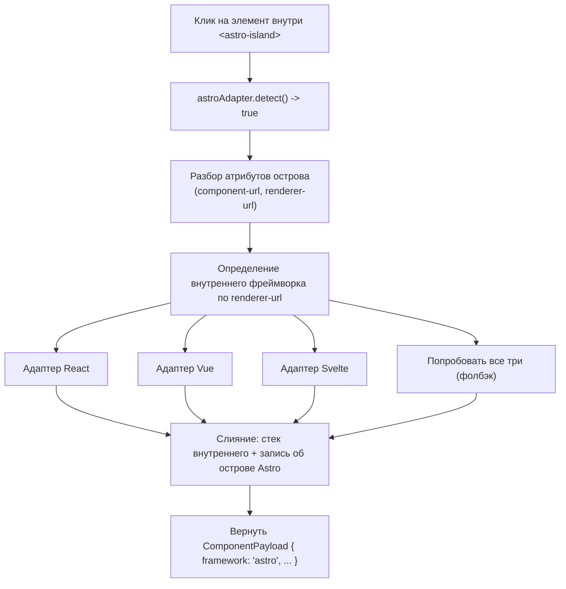

# Архитектура Click-to-Component

## Содержание

1. [Обзор](#1-обзор)
2. [Архитектура адаптеров](#2-архитектура-адаптеров)
3. [Модель данных ComponentPayload](#3-модель-данных-componentpayload)
4. [Адаптер React](#4-адаптер-react)
5. [Адаптер Vue](#5-адаптер-vue)
6. [Адаптер Svelte](#6-адаптер-svelte)
7. [Адаптер Astro](#7-адаптер-astro)
8. [HTML-фолбэк](#8-html-фолбэк)
9. [Оверлей и режим инспекции](#9-оверлей-и-режим-инспекции)
10. [Протокол PostMessage](#10-протокол-postmessage)
11. [Диагностика обнаружения фреймворков](#11-диагностика-обнаружения-фреймворков)
12. [Сравнительная таблица фреймворков](#12-сравнительная-таблица-фреймворков)
13. [Файловые ссылки](#13-файловые-ссылки)

---

## 1. Обзор

Click-to-Component позволяет пользователю кликнуть на любой элемент в превью-iframe и мгновенно узнать, какой компонент фреймворка его отрендерил. Система извлекает подробные метаданные: имя компонента, путь к исходному файлу, номер строки, CSS-класс и полную иерархию компонентов (стек). Результат отображается как структурированный бейдж в Lexical-редакторе чата, а затем отправляется AI-агенту в виде структурированного JSON.

По сути, это аналог инспектора элементов в DevTools браузера, но вместо сырых DOM-узлов вы видите *компонентную* картину. Кликаете на кнопку и получаете не просто `<button class="btn-primary">`, а `Button` из `src/components/Button.tsx`, строка 42, вложенный в `Toolbar > Header > App`.

Функция работает с четырьмя фреймворками (React, Vue, Svelte, Astro) плюс фолбэк на чистый HTML. Каждый фреймворк обслуживается собственным адаптером, который знает, как извлечь информацию о компоненте из внутренних структур данных фреймворка. Все адаптеры реализуют единый интерфейс и зарегистрированы в упорядоченном списке. При клике система перебирает адаптеры по порядку, пока один из них не вернёт результат.

В этом документе подробно описан каждый слой системы: паттерн адаптеров, внутреннее устройство каждого адаптера, оверлей, протокол postMessage и диагностические инструменты.

---

## 2. Архитектура адаптеров

Вся система Click-to-Component живёт в одном файле: `click_to_component_script.js` (791 строка). Файл разбит на чётко обозначенные секции, организованные сверху вниз.

```
+---------------------------------------------------+
|            click_to_component_script.js            |
|                                                    |
|  +----------------------------------------------+ |
|  |  CORE: Состояние и утилиты                    | |
|  |  - inspectModeActive (флаг)                   | |
|  |  - send() (хелпер postMessage)                | |
|  |  - getHTMLPreview() (снимок элемента)         | |
|  +----------------------------------------------+ |
|                                                    |
|  +----------------------------------------------+ |
|  |  ИНТЕРФЕЙС АДАПТЕРА                           | |
|  |  {                                            | |
|  |    name: string,                              | |
|  |    detect: (el) -> boolean,                   | |
|  |    getComponentInfo: (el) -> Promise<Payload>,| |
|  |    getOverlayLabel?: (el) -> string | null    | |
|  |  }                                            | |
|  +----------------------------------------------+ |
|                                                    |
|  +----------+ +----------+ +----------+ +--------+ |
|  |  REACT   | |   VUE    | |  SVELTE  | | ASTRO  | |
|  |  АДАПТЕР | |  АДАПТЕР | |  АДАПТЕР | | АДАПТ. | |
|  +----------+ +----------+ +----------+ +--------+ |
|                                                    |
|  +----------------------------------------------+ |
|  |  HTML-ФОЛБЭК                                 | |
|  +----------------------------------------------+ |
|                                                    |
|  +----------------------------------------------+ |
|  |  РЕЕСТР АДАПТЕРОВ И ДИСПЕТЧЕР                 | |
|  |  - adapters = [astro, react, vue, svelte]     | |
|  |  - getElementContext() -- первое совпадение   | |
|  |  - detectFrameworks() -- диагностика          | |
|  +----------------------------------------------+ |
|                                                    |
|  +----------------------------------------------+ |
|  |  CORE: Оверлей, события и инициализация       | |
|  |  - createOverlay() / positionOverlay()        | |
|  |  - onClick() / onMouseOver()                  | |
|  |  - setInspectMode()                           | |
|  |  - обработчик сообщений                       | |
|  +----------------------------------------------+ |
+---------------------------------------------------+
```

### Интерфейс адаптера

Каждый адаптер реализует один и тот же контракт:

```typescript
interface Adapter {
  name: string;
  detect: (element: HTMLElement) => boolean;
  getComponentInfo: (element: HTMLElement) => Promise<ComponentPayload | null>;
  getOverlayLabel?: (element: HTMLElement) => string | null;
}
```

- **`name`**: Человекочитаемый идентификатор (`'react'`, `'vue'`, `'svelte'`, `'astro'`).
- **`detect(element)`**: Быстрая синхронная проверка. Возвращает `true`, если адаптер может обработать данный DOM-элемент. Должна работать быстро, потому что вызывается для каждого кандидата.
- **`getComponentInfo(element)`**: Основная работа. Извлекает полные метаданные компонента из элемента. Возвращает `ComponentPayload` или `null`, если извлечение не удалось, несмотря на успешную детекцию.
- **`getOverlayLabel(element)`** *(опционально)*: Возвращает короткую строку для подписи в оверлее при наведении. Если не реализован, система берёт имя компонента из `getComponentInfo`.

### Порядок регистрации

Массив адаптеров упорядочен намеренно:

```javascript
const adapters = [astroAdapter, reactAdapter, vueAdapter, svelteAdapter];
```

Astro стоит первым, потому что элементы `<astro-island>` оборачивают компоненты других фреймворков. Адаптер Astro должен получить приоритет, чтобы перехватить такие элементы и делегировать обработку внутреннему адаптеру (React, Vue или Svelte), сохранив при этом метаданные самого острова.

HTML-фолбэк находится вне этого массива. Он вызывается отдельно, только когда ни один адаптер не прошёл детекцию или вернул `null` из `getComponentInfo`.

### Логика диспетчера

Функция `getElementContext()` является центральным диспетчером:

```
Для каждого адаптера в [astro, react, vue, svelte]:
    если adapter.detect(element) вернул true:
        result = await adapter.getComponentInfo(element)
        если result не null:
            вернуть result
        иначе:
            перейти к HTML-фолбэку

Если ни один адаптер не совпал:
    вернуть результат HTML-фолбэка
```

Подход «первое совпадение побеждает» сохраняет простоту. Элемент либо принадлежит фреймворку, либо нет. Когда адаптер обнаруживает элемент, но не может извлечь полезную информацию (возвращает `null`), система не пробует следующий адаптер. Она сразу переходит к HTML-фолбэку. Это предотвращает путаницу, когда React-элемент мог бы случайно совпасть с эвристикой Vue.

---

## 3. Модель данных ComponentPayload

Каждый адаптер формирует объект `ComponentPayload`. Это каноническая структура данных, которая передаётся из iframe в родительское окно и в конечном счёте попадает к AI-агенту.

```typescript
interface ComponentPayload {
  framework: string;     // 'react' | 'vue' | 'svelte' | 'astro' | 'html'
  component: string;     // Имя компонента: 'Button', 'UserProfile'
  tagName?: string;      // HTML-тег: 'button', 'div'
  file?: string;         // Путь к файлу: 'src/components/Button.tsx'
  line?: number;         // Номер строки (Svelte, React с source maps)
  column?: number;       // Номер столбца (только Svelte)
  cssClass?: string;     // Первый CSS-класс элемента
  stack?: Array<{        // Иерархия компонентов (от внутреннего к внешнему)
    name: string;
    file?: string;
  }>;
  htmlPreview: string;   // Снимок HTML-элемента (только открывающий тег)
}
```

Несколько важных деталей:

**`framework`** указывает, какой адаптер сформировал результат. AI-агент использует это поле, чтобы понять, с каким типом проекта он работает.

**`component`** содержит отображаемое имя. Для React оно берётся из дерева файберов. Для Vue из свойства `name` типа компонента (с несколькими фолбэками). Для Svelte извлекается из имени файла. Для HTML-фолбэка это просто имя тега в верхнем регистре.

**`stack`** представляет иерархию компонентов от внутреннего (кликнутый компонент) к внешнему (корень). Не все фреймворки поддерживают это одинаково. React предоставляет глубокие owner-стеки, Vue обходит цепочку родителей, Svelte даёт только одну запись, а Astro объединяет стек внутреннего фреймворка с записью об острове.

**`htmlPreview`** содержит очищенный снимок открывающего тега элемента. Это даёт AI-агенту быстрое представление о фактическом DOM-выводе без необходимости инспектировать страницу.

**`line` и `column`** надёжно доступны только из Svelte (через `__svelte_meta`) и React (через source maps через VKBippy). Vue не предоставляет номера строк без специального плагина сборки.

---

## 4. Адаптер React

*Строки 78-244 в `click_to_component_script.js`*

Адаптер React самый сложный из четырёх. Он опирается на VKBippy, глобальный объект, устанавливаемый скриптом `bippy_bundle.js`, который подключается к внутреннему дереву файберов React.

### Детекция

```javascript
VKBippy.isInstrumentationActive() && VKBippy.getFiberFromHostInstance(element)
```

Оба условия должны быть истинными. `isInstrumentationActive()` подтверждает, что VKBippy успешно пропатчил внутренности React. `getFiberFromHostInstance(element)` проверяет, есть ли у конкретного DOM-элемента связанный файбер-узел React. Если страница не является React-приложением или VKBippy не удалось инициализироваться, детекция сразу возвращает `false`.

VKBippy внедряется в превью-iframe как отдельный скрипт (`bippy_bundle.js`), загружаемый сразу после тега `<head>`. Он патчит реконсайлер React, открывая доступ к дереву файберов через чистый API.

### Извлечение информации о компоненте

Процесс извлечения имеет два пути в зависимости от доступности owner-стека:

1. **Получить файбер**: `VKBippy.getFiberFromHostInstance(element)` возвращает файбер-узел для DOM-элемента.
2. **Попробовать owner-стек**: `VKBippy.getOwnerStack(fiber)` выполняет асинхронный вызов, возвращающий расположение исходных файлов с номерами строк и столбцов. Если вызов успешен и возвращает записи с исходными файлами, адаптер формирует записи стека в формате `файл:строка:столбец`.
3. **Фолбэк на обход файберов**: Если owner-стек пуст или недоступен, адаптер обходит дерево файберов вверх через `VKBippy.traverseFiber(fiber, callback, goUp=true)`. Это собирает имена компонентов, но без данных о расположении файлов.

### Фильтрация имён

Дерево файберов React содержит множество внутренних компонентов, которые бесполезно показывать пользователю. Адаптер применяет два уровня фильтрации:

**Списки внутренних компонентов фреймворков:**
- `NEXT_INTERNAL`: имена вроде `InnerLayoutRouter`, `RedirectErrorBoundary`, `HotReload` и другие служебные компоненты Next.js.
- `REACT_INTERNAL`: имена вроде `Suspense`, `Fragment`, `StrictMode`, `Profiler`.

**Эвристические фильтры:**
- `isSourceComponentName(name)`: Отклоняет имена, начинающиеся с `_` (приватные/сгенерированные), имена со строчной буквы (HTML-элементы или хуки), имена, содержащие одновременно `Provider` и `Context` (обёртки контекста React), и имена, начинающиеся с `Primitive.` (примитивы Radix UI).
- `isUsefulComponentName(name)`: Менее строгая версия, используемая для подписей в оверлее. Применяет похожие правила, но с меньшим количеством исключений.

Эти фильтры гарантируют, что пользователь видит осмысленные имена компонентов вроде `UserProfile` или `ShoppingCart`, а не `Suspense > InnerLayoutRouter > RedirectErrorBoundary`.

### Подпись в оверлее

Функция `getNearestComponentName()` обходит цепочку `.return` файбера (указатели на родителя), чтобы найти первый компонент с полезным именем. Это обеспечивает подпись при наведении в режиме инспекции, до того как пользователь кликнет.

---

## 5. Адаптер Vue

*Строки 246-355 в `click_to_component_script.js`*

### Детекция

Функция `isVueElement(element)` выполняет двухэтапную проверку:

1. **Глобальная проверка**: должен существовать `window.__VUE__`. Этот глобальный объект устанавливается рантаймом Vue в режиме разработки. Если его нет, страница либо не использует Vue, либо работает в продакшн-режиме.
2. **Обход DOM**: начиная от кликнутого элемента, обход вверх по дереву DOM (максимум 50 предков). На каждом узле проверяется наличие `el.__VUE__` или `el.__vueParentComponent`. Эти свойства прикрепляются рантаймом Vue к элементам, которые служат точками монтирования компонентов.

Ограничение в 50 предков предотвращает проблемы с производительностью на глубоко вложенных DOM-деревьях, при этом покрывая большинство реальных иерархий компонентов.

### Извлечение информации о компоненте

1. **Поиск экземпляра Vue**: `findVueInstance(element)` обходит DOM вверх, ища `el.__VUE__[0]` (первый экземпляр Vue-приложения на элементе) или `el.__vueParentComponent` (экземпляр родительского компонента).

2. **Определение имени компонента** использует цепочку из четырёх фолбэков:
   ```
   type.displayName || type.name || type.__name || extractNameFromFile(type.__file) || 'Anonymous'
   ```
   Функция `extractNameFromFile` берёт путь вроде `src/components/UserCard.vue` и извлекает `UserCard`. Это обрабатывает однофайловые компоненты (SFC), у которых может не быть явного имени, но есть свойство `__file` в режиме разработки.

3. **Путь к файлу**: берётся из `instance.type.__file`. Доступен только для SFC-компонентов, скомпилированных в режиме разработки. Продакшн-сборки удаляют эту информацию.

4. **Построение стека**: адаптер обходит `instance.parent` до 20 уровней, собирая `{ name, file }` для каждого компонента, который не является `'Anonymous'`. Это формирует осмысленную иерархию вроде `UserCard > UserList > Dashboard > App`.

### Ограничения

Рантайм Vue не предоставляет номера строк. Для получения точности до строки потребовался бы плагин сборки вроде `unplugin-vue-source`, который невозможно внедрить во время выполнения.

Глобальный объект `__VUE__` существует только в режиме разработки. Продакшн-сборки Vue удаляют все отладочные метаданные, делая обнаружение компонентов невозможным.

Приложения на Nuxt 3 и Nuxt 4 работают идентично, поскольку используют те же внутренние механизмы Vue 3. Адаптер протестирован с Vue 3.3, 3.4 и 3.5.

---

## 6. Адаптер Svelte

*Строки 357-462 в `click_to_component_script.js`*

### Детекция

`findSvelteMeta(element)` обходит DOM вверх (максимум 50 предков), ища элемент со свойством `__svelte_meta`. Это свойство прикрепляется компилятором Svelte в режиме разработки и содержит информацию о расположении в исходном коде.

### Извлечение информации о компоненте

1. **Расположение в исходнике**: `element.__svelte_meta.loc` предоставляет `{ file, line, column }`. Это самое точное сопоставление с исходным кодом среди всех адаптеров: точный файл, строка и столбец без source maps и плагинов сборки.

2. **Имя компонента**: извлекается из пути к файлу. `'src/lib/Button.svelte'` становится `'Button'`. Адаптер отбрасывает путь к директории и расширение `.svelte`.

3. **CSS-класс**: адаптер выбирает первый CSS-класс, не соответствующий паттерну `svelte-*`. Svelte генерирует скопированные CSS-классы вроде `svelte-1a2b3c` (на основе хэшей), и они бесполезны для идентификации. Первый не-хэшевый класс обычно тот, который написал разработчик.

4. **Стек**: всегда одна запись. Рантайм Svelte не предоставляет цепочку родительских компонентов, как это делают React и Vue. Вы получаете непосредственный компонент, и ничего больше.

5. **Формат расположения файла**: поле file включает строку и столбец: `'src/lib/Button.svelte:42:3'`. Это даёт AI-агенту всё необходимое для перехода к нужному месту в исходном коде.

### Проблема Svelte 5

Svelte единственный фреймворк, предоставляющий номера строк и столбцов без плагинов сборки. Но есть подвох.

В Svelte 5 с режимом runes свойство `__svelte_meta` было намеренно удалено (отслеживается в Svelte issue #11389). Команда Svelte решила, что раскрытие метаданных компилятора во время выполнения было деталью реализации, на которую не следует полагаться. Это означает, что адаптер работает со Svelte 4 и Svelte 5 в legacy-режиме, но обнаружение компонентов в Svelte 5 с runes невозможно. Обходного пути нет. Метаданные просто не существуют во время выполнения.

---

## 7. Адаптер Astro

*Строки 464-597 в `click_to_component_script.js`*

Адаптер Astro уникален, потому что Astro является мета-фреймворком. Он не рендерит компоненты сам. Вместо этого он оборачивает компоненты других фреймворков (React, Vue, Svelte) в пользовательские элементы `<astro-island>`. Задача адаптера: идентифицировать остров, извлечь метаданные уровня Astro, а затем делегировать обработку соответствующему внутреннему адаптеру.

### Детекция

```javascript
element.closest('astro-island')
```

Просто и эффективно. Если кликнутый элемент находится внутри пользовательского элемента `<astro-island>`, адаптер Astro берёт его на себя.

### Извлечение информации о компоненте

1. **Получить остров**: `element.closest('astro-island')` возвращает оборачивающий пользовательский элемент.

2. **Разбор атрибутов острова**:
   - `component-url`: путь к исходнику, например `/src/components/Counter.jsx`
   - `component-export`: обычно `'default'`
   - `renderer-url`: идентифицирует внутренний фреймворк. URL содержит подсказки вроде `'react'`, `'vue'` или `'svelte'`
   - `client`: директива гидратации (`client:load`, `client:visible` и т.д.)

3. **Делегирование внутреннему фреймворку**: здесь начинается самое интересное. Функция `getInnerFrameworkInfo()` анализирует `renderer-url`, чтобы определить, какой внутренний адаптер попробовать:



Логика делегирования работает так:
- Если `renderer-url` содержит `'react'`, пробуется `reactAdapter` на внутреннем элементе
- Если содержит `'vue'`, пробуется `vueAdapter`
- Если содержит `'svelte'`, пробуется `svelteAdapter`
- Если подсказка не найдена, пробуются все три адаптера последовательно

Функция обходит DOM от кликнутого элемента вверх к границе острова, пробуя выбранный адаптер на каждом DOM-узле, пока не получит результат.

4. **Слияние стеков**: финальный стек объединяет стек внутреннего компонента (если найден) с записью об острове Astro, добавленной в конец. Результат может выглядеть так: `Button > Counter > [AstroIsland: Counter.jsx]`.

5. **Имя компонента**: если внутренний адаптер нашёл имя компонента, используется оно. В противном случае имя извлекается из атрибута `component-url`.

### Подпись в оверлее

Оверлей сначала пробует `getOverlayLabel` внутреннего фреймворка. Если тот ничего не вернул, используется имя компонента Astro, извлечённое из атрибутов острова.

---

## 8. HTML-фолбэк

*Строки 600-621 в `click_to_component_script.js`*

HTML-фолбэк является «ловушкой для всего». Когда ни один адаптер фреймворка не совпал с элементом (или когда адаптер обнаружил элемент, но вернул `null`), срабатывает этот фолбэк.

- **`detect()`** всегда возвращает `true`. Он не входит в массив адаптеров, а является отдельной ветвью кода.
- **Возвращает**: `{ framework: 'html', component: tagName, tagName, cssClass, htmlPreview }`
- **Нет стека**, нет пути к файлу, нет номеров строк. Только сырая информация об HTML-элементе.

Это гарантирует, что каждый клик даёт *какой-то* результат. Даже на статической HTML-странице без фреймворка пользователь получает имя тега, CSS-класс и HTML-превью. AI-агент всё равно может использовать эту информацию для поиска элемента в исходном коде.

---

## 9. Оверлей и режим инспекции

### Поток активации

1. Родительское окно отправляет postMessage в iframe:
   ```json
   {
     "source": "click-to-component",
     "type": "toggle-inspect",
     "payload": { "active": true }
   }
   ```
2. Скрипт получает сообщение и вызывает `setInspectMode(true)`.
3. Создаётся div-оверлей с фиксированным позиционированием, синей рамкой (`2px solid rgba(59, 130, 246, 0.8)`), полупрозрачным синим фоном (`rgba(59, 130, 246, 0.1)`) и `z-index: 999999`.
4. Создаётся div-подпись с абсолютным позиционированием (`top: -22px`), синим фоном, белым текстом, шрифтом 11px.
5. Курсор меняется на перекрестие: `document.body.style.cursor = 'crosshair'`.
6. Регистрируются обработчики событий в фазе захвата для `mouseover` и `click`.

### Поведение при наведении

Когда пользователь наводит курсор на элемент, срабатывает `positionOverlay(element)`. Функция считывает ограничивающий прямоугольник элемента и позиционирует div-оверлей точно по его размерам. Подпись показывает имя компонента (из `getOverlayLabel` адаптера или быстрого прохода детекции). Это даёт мгновенную визуальную обратную связь о том, какой компонент пользователь собирается выбрать.

### Поведение при клике

Когда пользователь кликает:

1. **Подавление события**: срабатывают `event.preventDefault()`, `stopPropagation()` и `stopImmediatePropagation()`. Это предотвращает любое поведение приложения по умолчанию (навигацию, отправку формы, изменение состояния).
2. **Немедленный выход из режима**: `setInspectMode(false)` выполняется сразу. Оверлей исчезает, курсор возвращается в нормальное состояние, обработчики событий удаляются. Это даёт мгновенную визуальную обратную связь о том, что клик был перехвачен.
3. **Асинхронное извлечение**: `getElementContext(element)` запускает конвейер диспетчеризации адаптеров. Это асинхронная операция, потому что некоторые адаптеры (в частности, owner-стек React) выполняют асинхронную работу.
4. **Доставка результата**: `send('component-detected', componentPayload, 2)` отправляет результат в родительское окно по протоколу v2.

Порядок важен. Выход из режима инспекции до запуска асинхронного извлечения обеспечивает отзывчивость интерфейса. Пользователь видит исчезновение оверлея мгновенно, даже если адаптеру требуется время для получения информации о компоненте.

---

## 10. Протокол PostMessage

Вся коммуникация между превью-iframe и родительским окном Vibe Kanban происходит через `window.postMessage`. Протокол имеет две версии.

### Протокол v2 (текущий)

```json
{
  "source": "click-to-component",
  "type": "component-detected",
  "version": 2,
  "payload": {
    "framework": "react",
    "component": "Button",
    "file": "src/components/Button.tsx",
    "line": 42,
    "stack": [
      { "name": "Button", "file": "src/components/Button.tsx:42:5" },
      { "name": "Toolbar", "file": "src/components/Toolbar.tsx:18:3" }
    ],
    "htmlPreview": "<button class=\"btn-primary\">"
  }
}
```

Протокол v2 передаёт полный `ComponentPayload` как структурированные данные. Родительское окно разбирает их и создаёт богатый бейдж в Lexical-редакторе, затем пересылает JSON AI-агенту.

### Протокол v1 (устаревший)

```json
{
  "source": "click-to-component",
  "type": "component-detected",
  "payload": {
    "markdown": "**Button** (`src/components/Button.tsx`)\n\nStack: Button > Toolbar > App"
  }
}
```

Протокол v1 отправлял предварительно отформатированную markdown-строку. Он по-прежнему поддерживается для обратной совместимости, но несёт меньше структурированной информации.

### Переключение режима инспекции (родитель к iframe)

```json
{
  "source": "click-to-component",
  "type": "toggle-inspect",
  "payload": { "active": true }
}
```

Это сообщение идёт в обратном направлении. Родительское окно отправляет его в iframe для активации или деактивации режима инспекции. Булево значение `active` управляет переключением.

Все сообщения включают `"source": "click-to-component"` как пространство имён, чтобы избежать конфликтов с другим postMessage-трафиком на странице.

---

## 11. Диагностика обнаружения фреймворков

При событии `DOMContentLoaded` скрипт выполняет диагностический проход и логирует обнаруженные фреймворки:

```
[vk-ctc] Detected frameworks: react, vue
```

Проверки детекции представляют собой лёгкие зонды:

| Фреймворк | Проверка детекции |
|-----------|-------------------|
| Astro | `document.querySelector('astro-island')` |
| React | `VKBippy.isInstrumentationActive()` |
| Vue | `window.__VUE__` или `document.querySelector('[data-v-app]')` |
| Svelte | `document.querySelector('[class*="svelte-"]')` или `document.querySelector('[data-svelte-h]')` |

Эти проверки выполняются один раз при загрузке страницы и носят исключительно информационный характер. Они не влияют на поведение адаптеров. Фактическая диспетчеризация адаптеров происходит при каждом клике через метод `detect()` каждого адаптера. Диагностический лог помогает разработчикам убедиться, что скрипт корректно определил фреймворки, присутствующие на странице.

Обратите внимание, что на странице может быть обнаружено несколько фреймворков одновременно. Сайт на Astro может показать `astro, react, vue`, если использует острова и из React, и из Vue. Приложение на Next.js покажет только `react`.

---

## 12. Сравнительная таблица фреймворков

| Возможность | React | Vue 3 | Svelte 4 | Astro | HTML-фолбэк |
|-------------|-------|-------|----------|-------|-------------|
| Метод детекции | VKBippy fiber | `__VUE__[0]` | `__svelte_meta` | `<astro-island>` | Всегда |
| Имя компонента | Да (fiber) | Да (4 фолбэка) | Да (из имени файла) | Да (из URL) | Только имя тега |
| Путь к файлу | Да (source maps) | Да (только SFC) | Да | Да (component-url) | Нет |
| Номер строки | Да (source maps) | Нет | Да | Нет | Нет |
| Номер столбца | Да (source maps) | Нет | Да | Нет | Нет |
| Стек компонентов | Да (owner stack) | Да (цепочка parent) | Нет (одна запись) | Да (внутренний + остров) | Нет |
| CSS-класс | Нет | Да | Да (не-svelte) | Нет | Да |
| Работает в продакшне | Нет | Нет | Нет | Да (атрибуты сохраняются) | Да |
| Нужен плагин сборки | Нет (VKBippy) | Нет | Нет | Нет | Нет |

Ключевые выводы из этого сравнения:

- **Svelte** предоставляет самые богатые данные для отдельного элемента (файл + строка + столбец), но не может показать иерархию компонентов.
- **React** предоставляет самые глубокие стеки компонентов через обход файберов и owner-стеки.
- **Vue** занимает среднюю позицию: стеки компонентов и пути к файлам, но без номеров строк.
- **Astro** единственный фреймворк, где детекция работает в продакшне, потому что атрибуты `<astro-island>` переживают процесс сборки.
- **Ни один адаптер не требует плагина сборки.** Всё работает через инспекцию внутренних структур фреймворков или DOM-атрибутов во время выполнения. VKBippy внедряется в рантайме, а не на этапе сборки.

---

## 13. Файловые ссылки

| Файл | Описание |
|------|----------|
| `crates/server/src/preview_proxy/click_to_component_script.js` | Основной скрипт (791 строка). Содержит все адаптеры, диспетчер, UI оверлея и обработку postMessage. |
| `crates/server/src/preview_proxy/bippy_bundle.js` | Хук инспекции файберов React. Внедряется в превью-iframe перед собственными скриптами страницы. Предоставляет глобальный объект `VKBippy`. |
| `crates/server/src/preview_proxy/mod.rs` | Модуль прокси-сервера на Rust. Обрабатывает внедрение скриптов в HTML-ответ превью-iframe, вставляя `bippy_bundle.js` и `click_to_component_script.js` после тега `<head>`. |

Прокси-сервер (`mod.rs`) перехватывает HTML-ответы от dev-сервера пользователя и внедряет скрипты инспекции. Такой подход означает, что функция работает с любым фреймворком без изменений в конфигурации проекта пользователя. Скрипты внедряются прозрачно и очищают за собой при деактивации режима инспекции.
