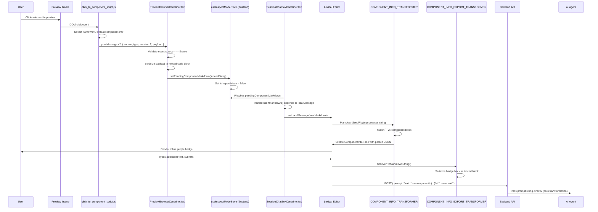

# Lexical WYSIWYG Editor Integration for Click-to-Component

## 1. Overview

Vibe Kanban's chat interface uses a [Lexical](https://lexical.dev/) WYSIWYG editor as the input box where users type messages to AI coding agents. When a user clicks a component in the preview iframe, the system extracts structured information about that component and inserts it into the editor as a **rich inline badge**, not raw text.

The badge appears as a compact purple pill (e.g., `<UserProfile>`) that sits inline with the surrounding text. Hovering over it reveals a tooltip with structured details: file path, line number, CSS class, and the component tree. When the user submits the message, the badge serializes back into a fenced code block that the AI agent receives as structured JSON.

This design draws inspiration from [react-grab](https://github.com/nichenqin/react-grab): a compact purple/magenta inline badge with a hover tooltip showing structured component details.

The key insight is that the editor acts as a **bidirectional transformer**. Markdown with fenced code blocks flows in, gets rendered as visual badges, and flows back out as identical markdown when submitted. The user sees a polished UI. The AI agent sees clean, parseable data. Neither side needs to know about the other's representation.

---

## 2. Data Flow: End to End

The journey from a click in the preview iframe to a structured prompt reaching the AI agent involves 18 discrete steps across the iframe boundary, the React application layer, a Zustand store, the Lexical editor, and the API pipeline.



### Step-by-step breakdown

1. **User clicks element** in the preview iframe.
2. **`click_to_component_script.js`** detects the framework (React, Vue, Svelte, Astro, or plain HTML) and extracts component metadata.
3. The script sends a **postMessage v2** to the parent window: `{ source, type, version: 2, payload: ComponentPayload }`.
4. **`PreviewBrowserContainer.tsx`** receives the message. It checks `event.source` matches the iframe reference to reject spoofed messages.
5. The container **serializes** the payload into a fenced code block: `` ```vk-component\n{JSON}\n``` ``.
6. It calls **`setPendingComponentMarkdown(fencedString)`** on the Zustand store.
7. **`SessionChatBoxContainer.tsx`** watches the store via a `useEffect` hook and calls `handleInsertMarkdown()`.
8. `handleInsertMarkdown` **appends** the fenced string to `localMessage` (with a double newline separator if text already exists).
9. Lexical's **`MarkdownSyncPlugin`** processes the updated markdown string.
10. **`COMPONENT_INFO_TRANSFORMER`** matches the `` ```vk-component `` opening fence.
11. The transformer **creates a `ComponentInfoNode`** with the parsed JSON data.
12. The `ComponentInfoNode` **renders as an inline purple badge** in the editor.
13. The user types additional text around the badge, then **submits**.
14. Lexical exports markdown via **`$convertToMarkdownString()`**.
15. **`COMPONENT_INFO_EXPORT_TRANSFORMER`** serializes the badge back to a fenced code block.
16. The message is sent to the API: `{ prompt: "text ```vk-component\n{...}\n``` more text" }`.
17. The Rust backend in `coding_agent_follow_up.rs` **passes the prompt string directly** to the AI agent with zero transformation.
18. The agent receives the structured JSON inside the fenced block and can parse it.

---

## 3. The `createDecoratorNode` Factory

Rather than hand-writing each custom Lexical node from scratch, the project provides a generic factory function in `create-decorator-node.tsx`. Every custom decorator node in the editor (images, PR comments, component info badges) is built through this factory.

### Factory config interface

```typescript
interface DecoratorNodeConfig<T> {
  type: string;                        // Node type name
  serialization: SerializationConfig<T>; // How to serialize/deserialize
  component: React.ComponentType<{     // React component to render
    data: T;
    nodeKey: NodeKey;
    onDoubleClickEdit: (event: React.MouseEvent) => void;
  }>;
  domStyle?: Partial<CSSStyleDeclaration>; // Wrapper element styles
  keyboardSelectable?: boolean;            // Arrow key behavior
  exportDOM?: (data: T) => HTMLElement;    // HTML export
}
```

For the ComponentInfoNode, the serialization config uses the **fenced** format:

```typescript
{
  format: 'fenced',
  language: 'vk-component',           // Fenced block language identifier
  serialize: (data) => JSON.stringify(data),
  deserialize: (content) => JSON.parse(content),
  validate: (data) => !!(data.framework && data.component && data.htmlPreview),
}
```

The `validate` function ensures that only well-formed payloads produce badges. If the JSON is missing required fields, the transformer skips it and the raw code block remains visible.

### Factory output

The factory returns a bundle of everything needed to integrate the node into Lexical:

```typescript
{
  Node: ComponentInfoNode,              // The Lexical node class
  createNode: $createComponentInfoNode, // Factory function
  isNode: $isComponentInfoNode,         // Type guard
  transformers: [                       // Two transformers for fenced blocks
    COMPONENT_INFO_EXPORT_TRANSFORMER,  // Node -> markdown (export)
    COMPONENT_INFO_TRANSFORMER,         // Markdown -> node (import)
  ]
}
```

### Double-click editing

The factory's internal `NodeComponent` wrapper provides a double-click handler. When the user double-clicks a badge, the node is replaced with a `TextNode` containing the raw fenced code block text. The user can then edit the JSON directly. Once the cursor moves away, `MarkdownSyncPlugin` re-processes the text, the transformer matches the fenced block again, and a fresh badge appears with the updated data.

This gives power users an escape hatch to manually tweak component metadata without leaving the editor.

---

## 4. ComponentInfoNode

**File**: `frontend/src/components/ui/wysiwyg/nodes/component-info-node.tsx` (approximately 180 lines)

### Data model

```typescript
interface ComponentInfoData {
  framework: string;   // 'react', 'vue', 'svelte', 'astro', 'html'
  component: string;   // 'Button', 'UserProfile'
  tagName?: string;    // 'button', 'div'
  file?: string;       // 'src/components/Button.tsx'
  line?: number;
  column?: number;
  cssClass?: string;   // '.btn-primary'
  stack?: Array<{ name: string; file?: string }>;
  htmlPreview: string; // '<button class="btn">Click</button>'
}
```

Three fields are required: `framework`, `component`, and `htmlPreview`. Everything else is optional and only displayed when present. The `stack` array represents the component tree from the clicked element up to the root, enabling the tooltip's breadcrumb display.

### Node configuration

| Property | Value | Rationale |
|---|---|---|
| `type` | `'component-info'` | Unique identifier in Lexical's node registry |
| `keyboardSelectable` | `false` | Arrow keys skip over the badge, same as ImageNode |
| `domStyle.display` | `'inline-block'` | Badge sits inline with surrounding text |
| `domStyle.paddingLeft` | `'2px'` | Small horizontal spacing for cursor placement |
| `domStyle.paddingRight` | `'2px'` | Symmetric spacing on both sides |
| `domStyle.verticalAlign` | `'bottom'` | Aligns badge baseline with text baseline |

Setting `keyboardSelectable` to `false` means the user can't accidentally "enter" the badge with arrow keys. The badge behaves like a single atomic unit in the text flow.

---

## 5. Badge UI Component

The badge is the visible representation of a `ComponentInfoNode` in the editor. It's designed to be compact, recognizable, and unobtrusive.

### Display format

```
Normal text [<UserProfile>] more text after badge
              ^
        Purple badge
        inline with text
```

The display name follows this priority: `data.component || data.tagName || 'unknown'`. It's wrapped in angle brackets to visually echo JSX/HTML syntax: `<Button>`, `<div>`, `<UserProfile>`.

### Styling details

| Property | Value | Purpose |
|---|---|---|
| Layout | `inline-flex items-center` | Horizontal alignment with text |
| Padding | `px-1.5 py-0.5` | Compact but readable |
| Border radius | `rounded-md` | Subtle rounding |
| Font | `text-sm font-medium` | Slightly smaller than body text, bold enough to stand out |
| Background | `#D239C0` | Purple/magenta, matching react-grab's signature color |
| Text color | `#ffffff` | White on purple for high contrast |
| Max width | `max-w-[200px]` | Prevents long component names from breaking layout |
| Overflow | `text-ellipsis` | Truncates with "..." when name exceeds max width |
| Cursor | `cursor-default` | Arrow cursor, not text cursor |
| Selection | `select-none` | Prevents accidental text selection of badge content |
| Line height | `1.4` | Matches surrounding text for vertical alignment |

The purple color was chosen deliberately. It's distinct from blue (links), red (errors), green (success), and yellow (warnings), so badges never get confused with other UI elements.

---

## 6. Hover Tooltip

When the user hovers over a badge, a tooltip appears above it showing the full structured component information.

### Trigger mechanics

The tooltip uses `onMouseEnter` and `onMouseLeave` events on the badge's wrapper `<span>`. There's a **350ms delay** before the tooltip appears, implemented via `setTimeout`. A `useEffect` cleanup function clears the timer if the component unmounts or the mouse leaves before the delay expires. This prevents tooltip flicker when the cursor passes over a badge without stopping.

### Tooltip content

The tooltip displays structured rows. Only rows with actual data appear; there are no "undefined" or empty rows.

| Row | Condition | Font |
|---|---|---|
| **Component** | Always shown | Default |
| **File** | Shown if `data.file` exists | `font-ibm-plex-mono` (monospace) |
| **Line** | Shown if `data.line != null` | Default |
| **Class** | Shown if `data.cssClass` exists | `font-ibm-plex-mono` (monospace) |

If `data.stack` contains more than one entry, a **stack breadcrumb** appears below the rows, separated by a top border:

```
<Inner/> <- <Middle/> <- <Outer/>
```

This shows the component hierarchy from the clicked element up to its ancestors.

### Visual representation

```
     +-------------------------------------+
     | Component   UserProfile             |
     | File        src/components/U...     | <- monospace
     | Line        42                      |
     | Class       .text-[#5b5b5b]         | <- monospace
     |-------------------------------------|
     | <UserProfile/> <- <App/>            | <- stack breadcrumb
     +-------------------------------------+
                    |
     text text [<UserProfile>] text text
                 ^ badge
```

### Tooltip styling

| Property | Value | Purpose |
|---|---|---|
| Position | `absolute bottom-full left-1/2 -translate-x-1/2 mb-2` | Centered above the badge |
| Z-index | `999` | Floats above all editor content |
| Background | `bg-panel` | Dark background matching Vibe Kanban's theme |
| Border | `border border-low` | Subtle border for definition |
| Shadow | `shadow-lg` | Depth separation from editor surface |
| Border radius | `rounded-md` | Consistent with badge rounding |
| Padding | `px-base py-half` (12px horizontal, 6px vertical) | Comfortable reading space |
| Max width | `max-w-[300px]` | Prevents tooltip from growing too wide |
| Text overflow | Truncation with ellipsis | Long file paths get clipped |
| Pointer events | `pointer-events-none` | Tooltip doesn't interfere with mouse interaction |
| Animation | `componentInfoTooltipFadeIn` keyframes | `opacity 0->1, scale 0.97->1, 100ms ease-out` |

The `pointer-events-none` property is important: without it, the tooltip itself would trigger mouse events, causing flickering as the cursor alternates between "over badge" and "over tooltip" states.

---

## 7. ComponentInfoKeyboardPlugin

**File**: `frontend/src/components/ui/wysiwyg/plugins/component-info-keyboard-plugin.tsx` (52 lines)

### The problem

Lexical's default backspace and delete behavior doesn't handle decorator nodes that use `NodeSelection`. When a `ComponentInfoNode` is selected (highlighted), pressing Backspace does nothing. The node just sits there, unresponsive.

### The solution

`ComponentInfoKeyboardPlugin` registers command handlers for both `KEY_BACKSPACE_COMMAND` and `KEY_DELETE_COMMAND` at `COMMAND_PRIORITY_LOW`.

The logic on each key press:

1. Get the current selection from Lexical's editor state.
2. Check if it's a `NodeSelection` (not a `RangeSelection` or `GridSelection`).
3. Filter the selected nodes, looking for any that pass the `$isComponentInfoNode` type guard.
4. If component info nodes are found: remove them from the editor and return `true` (event handled).
5. If none are found: return `false` (let Lexical's default behavior handle the key press).

This pattern is identical to `ImageKeyboardPlugin`, which solves the same problem for image nodes. Both plugins coexist without conflict because they only act on their respective node types.

---

## 8. Registration in wysiwyg.tsx

The Lexical editor configuration lives in `wysiwyg.tsx` (approximately 536 lines). Three registration points wire the ComponentInfoNode into the editor.

### 1. Node registration (line 319)

```typescript
nodes: [
  HeadingNode, QuoteNode, ListNode, ListItemNode,
  CodeNode, CodeHighlightNode, LinkNode,
  ImageNode, PrCommentNode, ComponentInfoNode,  // <-- Added here
  TableNode, TableRowNode, TableCellNode,
]
```

This tells Lexical that `ComponentInfoNode` is a valid node type. Without this registration, the editor would reject any attempt to create one.

### 2. Transformer registration (lines 335-336)

```typescript
const extendedTransformers = [
  TABLE_TRANSFORMER, IMAGE_TRANSFORMER,
  PR_COMMENT_EXPORT_TRANSFORMER, PR_COMMENT_TRANSFORMER,
  COMPONENT_INFO_EXPORT_TRANSFORMER, COMPONENT_INFO_TRANSFORMER,  // <-- Added here
  CODE, ...TRANSFORMERS,
]
```

**Order matters here.** Custom fenced transformers MUST come BEFORE the generic `CODE` transformer. The reason: transformers are evaluated in order, and the first match wins. If `CODE` came first, it would consume `` ```vk-component `` blocks as generic code blocks, and the component info transformer would never see them.

### 3. Keyboard plugin (line 454)

```tsx
<ImageKeyboardPlugin />
<ComponentInfoKeyboardPlugin />  {/* <-- Added here */}
```

The plugin is mounted as a child of the Lexical editor's `LexicalComposer`. It registers its command handlers on mount and cleans them up on unmount.

---

## 9. Serialization Round-Trip

The serialization system ensures that component info badges survive any transformation: paste, copy, undo/redo, save, and submit all preserve the data perfectly.

### Markdown to Node (Import)

Given this markdown input:

````
```vk-component
{"framework":"react","component":"Button","tagName":"button","file":"src/Button.tsx","line":42,"cssClass":".btn-primary","htmlPreview":"<button>Click</button>","stack":[{"name":"Button","file":"src/Button.tsx"},{"name":"App","file":"src/App.tsx"}]}
```
````

The import process:

1. `MarkdownSyncPlugin` processes the markdown string.
2. `COMPONENT_INFO_TRANSFORMER` matches the `` ```vk-component `` opening fence.
3. The content between the fences is deserialized: `JSON.parse(content)`.
4. Validation checks that `framework`, `component`, and `htmlPreview` all exist.
5. A `ComponentInfoNode` is created with the parsed data.
6. Lexical renders the node as an inline purple badge.

### Node to Markdown (Export)

1. When the editor exports markdown (on change or on submit), `$convertToMarkdownString()` walks the node tree.
2. `COMPONENT_INFO_EXPORT_TRANSFORMER` matches `ComponentInfoNode` instances.
3. Each node serializes to: `` ```vk-component\n`` + `JSON.stringify(data)` + ``\n``` ``.
4. The fenced block is embedded in the output markdown string.

### Double-click edit cycle

1. User double-clicks a badge.
2. The `onDoubleClickEdit` handler fires.
3. The `ComponentInfoNode` is replaced with a `TextNode` containing the raw fenced code block.
4. The user edits the JSON text directly.
5. When the cursor leaves the text region, `MarkdownSyncPlugin` re-processes the content.
6. `COMPONENT_INFO_TRANSFORMER` matches the fenced block again and creates a new node.
7. The badge re-renders with the updated data.

This cycle can repeat indefinitely. The data is never lost because the fenced code block is the canonical representation.

---

## 10. Zustand Store: useInspectModeStore

**File**: `frontend/src/stores/useInspectModeStore.ts` (24 lines)

```typescript
interface InspectModeState {
  isInspectMode: boolean;
  setInspectMode: (active: boolean) => void;
  toggleInspectMode: () => void;
  pendingComponentMarkdown: string | null;        // The fenced code block string
  setPendingComponentMarkdown: (markdown: string | null) => void;
  clearPendingComponentMarkdown: () => void;
}
```

### Key behavior

When `setPendingComponentMarkdown(markdown)` is called with a non-null value, the setter also sets `isInspectMode: false`. This automatically exits inspect mode after a component is detected. The user clicks a component, the badge appears in the editor, and inspect mode turns off in one atomic state update. No extra cleanup needed.

### Type preservation

The `pendingComponentMarkdown` field is typed as `string | null`. When the system evolved from v1 (raw markdown) to v2 (fenced code blocks), the string content changed but the type stayed the same. This was intentional: changing the type would have required updates across every consumer of the store, while changing only the content required updates only at the producer (PreviewBrowserContainer) and the consumer (the Lexical transformer).

---

## 11. Auto-Paste Flow in SessionChatBoxContainer

**File**: `frontend/src/components/ui-new/containers/SessionChatBoxContainer.tsx`

```typescript
// Watch for pending component markdown
const pendingComponentMarkdown = useInspectModeStore(s => s.pendingComponentMarkdown);

useEffect(() => {
  if (pendingComponentMarkdown) {
    handleInsertMarkdown(pendingComponentMarkdown);  // Appends to local message
    clearPendingComponentMarkdown();                   // Clears the store
  }
}, [pendingComponentMarkdown]);

// handleInsertMarkdown:
const handleInsertMarkdown = (markdown: string) => {
  const currentMessage = localMessageRef.current;
  const newMessage = currentMessage.trim()
    ? `${currentMessage}\n\n${markdown}`  // Append with double newline
    : markdown;                            // Set as first content
  setLocalMessage(newMessage);
};
```

The double newline separator ensures the fenced code block starts on its own line, which is required for markdown parsers (and Lexical's transformer) to recognize it as a code block rather than inline code.

`localMessageRef.current` is used instead of the state value directly to avoid stale closure issues. The ref always points to the latest message content, even if the effect fires before a re-render.

---

## 12. Message Pipeline to AI Agent

```
Lexical Editor
  -> $convertToMarkdownString()
  -> localMessage string
  -> useSessionSend.ts: trimmedMessage
  -> POST /api/sessions/{id}/follow-up { prompt: message }
  -> Rust backend: coding_agent_follow_up.rs
  -> passes prompt directly to agent
  -> AI agent receives: "Check this component:\n\n```vk-component\n{JSON}\n```"
```

The fenced code block survives the entire pipeline **unchanged**. There is zero transformation at any step between the Lexical editor and the AI agent. The Rust backend treats the prompt as an opaque string. It doesn't parse, validate, or modify the content.

This design is deliberate. By keeping the backend ignorant of the fenced block format, the frontend can evolve the payload schema without requiring backend changes. The contract is simple: the frontend produces a string, the backend delivers it.

---

## 13. File Reference

| File | Lines | Purpose |
|---|---|---|
| `frontend/src/components/ui/wysiwyg/nodes/component-info-node.tsx` | ~180 | Badge component, tooltip, data model |
| `frontend/src/components/ui/wysiwyg/plugins/component-info-keyboard-plugin.tsx` | ~52 | Backspace/Delete handling for badges |
| `frontend/src/components/ui/wysiwyg/lib/create-decorator-node.tsx` | varies | Generic factory for all decorator nodes |
| `frontend/src/components/ui/wysiwyg.tsx` | ~536 | Editor config, node/transformer/plugin registration |
| `frontend/src/stores/useInspectModeStore.ts` | ~24 | Zustand store for inspect mode and pending markdown |
| `frontend/src/components/ui-new/containers/PreviewBrowserContainer.tsx` | varies | postMessage v2 protocol handler |
| `frontend/src/components/ui-new/containers/SessionChatBoxContainer.tsx` | varies | Auto-paste flow from store to editor |

---

## Appendix: Why Fenced Code Blocks?

The choice to represent component info as fenced code blocks (rather than, say, custom markdown syntax or HTML comments) was driven by three factors:

1. **AI agent compatibility.** Every major LLM understands fenced code blocks. The `vk-component` language tag tells the agent "this is structured data, parse it as JSON." No special instructions needed.

2. **Lexical transformer compatibility.** Lexical's markdown plugin already has a pattern for fenced code blocks. The factory's `fenced` serialization format hooks into this existing mechanism cleanly.

3. **Copy-paste resilience.** If a user copies text containing a badge and pastes it into a plain text editor, they get a valid fenced code block. Paste it back into the Lexical editor, and the badge reappears. The format is self-describing and portable.
