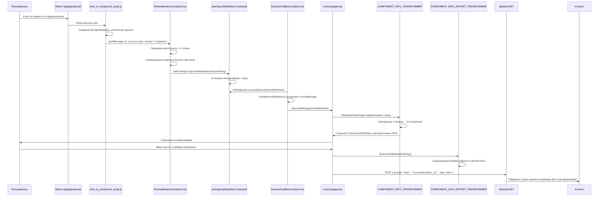

# Интеграция Lexical WYSIWYG-редактора с Click-to-Component

## 1. Обзор

Чат-интерфейс Vibe Kanban использует [Lexical](https://lexical.dev/) WYSIWYG-редактор в качестве поля ввода сообщений для AI-агентов. Когда пользователь кликает на компонент в iframe предпросмотра, система извлекает структурированную информацию об этом компоненте и вставляет её в редактор в виде **интерактивного инлайн-бейджа**, а не сырого текста.

Бейдж выглядит как компактная фиолетовая «таблетка» (например, `<UserProfile>`), которая располагается в строке вместе с окружающим текстом. При наведении курсора появляется всплывающая подсказка со структурированными данными: путь к файлу, номер строки, CSS-класс и дерево компонентов. При отправке сообщения бейдж сериализуется обратно в огороженный блок кода (fenced code block), который AI-агент получает как структурированный JSON.

Дизайн вдохновлён проектом [react-grab](https://github.com/nichenqin/react-grab): компактный фиолетово-пурпурный инлайн-бейдж с всплывающей подсказкой, отображающей детали компонента.

Ключевая идея: редактор работает как **двунаправленный трансформер**. Markdown с огороженными блоками кода поступает на вход, отрисовывается в виде визуальных бейджей, а при отправке преобразуется обратно в идентичный markdown. Пользователь видит красивый интерфейс. AI-агент получает чистые, парсируемые данные. Ни одна сторона не знает о представлении другой.

---

## 2. Поток данных: от клика до агента

Путь от клика в iframe предпросмотра до структурированного промпта, доходящего до AI-агента, включает 18 дискретных шагов: пересечение границы iframe, слой React-приложения, Zustand-хранилище, Lexical-редактор и API-пайплайн.



### Пошаговое описание

1. **Пользователь кликает по элементу** в iframe предпросмотра.
2. **`click_to_component_script.js`** определяет фреймворк (React, Vue, Svelte, Astro или чистый HTML) и извлекает метаданные компонента.
3. Скрипт отправляет **postMessage v2** в родительское окно: `{ source, type, version: 2, payload: ComponentPayload }`.
4. **`PreviewBrowserContainer.tsx`** получает сообщение. Проверяет, что `event.source` совпадает с ссылкой на iframe, чтобы отклонить поддельные сообщения.
5. Контейнер **сериализует** payload в огороженный блок кода: `` ```vk-component\n{JSON}\n``` ``.
6. Вызывает **`setPendingComponentMarkdown(fencedString)`** в Zustand-хранилище.
7. **`SessionChatBoxContainer.tsx`** отслеживает хранилище через хук `useEffect` и вызывает `handleInsertMarkdown()`.
8. `handleInsertMarkdown` **добавляет** огороженную строку к `localMessage` (с двойным переносом строки, если текст уже есть).
9. **`MarkdownSyncPlugin`** Lexical обрабатывает обновлённую markdown-строку.
10. **`COMPONENT_INFO_TRANSFORMER`** находит совпадение с открывающей оградой `` ```vk-component ``.
11. Трансформер **создаёт `ComponentInfoNode`** с распарсенными JSON-данными.
12. `ComponentInfoNode` **отрисовывается как инлайн-бейдж** фиолетового цвета в редакторе.
13. Пользователь вводит дополнительный текст вокруг бейджа и **отправляет сообщение**.
14. Lexical экспортирует markdown через **`$convertToMarkdownString()`**.
15. **`COMPONENT_INFO_EXPORT_TRANSFORMER`** сериализует бейдж обратно в огороженный блок кода.
16. Сообщение отправляется в API: `{ prompt: "текст ```vk-component\n{...}\n``` ещё текст" }`.
17. Rust-бэкенд в `coding_agent_follow_up.rs` **передаёт строку промпта напрямую** AI-агенту без каких-либо трансформаций.
18. Агент получает структурированный JSON внутри огороженного блока и может его распарсить.

---

## 3. Фабрика `createDecoratorNode`

Вместо ручного написания каждого кастомного узла Lexical с нуля, проект предоставляет универсальную фабричную функцию в `create-decorator-node.tsx`. Все кастомные декоратор-узлы редактора (изображения, PR-комментарии, бейджи компонентов) создаются через эту фабрику.

### Интерфейс конфигурации фабрики

```typescript
interface DecoratorNodeConfig<T> {
  type: string;                        // Имя типа узла
  serialization: SerializationConfig<T>; // Как сериализовать/десериализовать
  component: React.ComponentType<{     // React-компонент для отрисовки
    data: T;
    nodeKey: NodeKey;
    onDoubleClickEdit: (event: React.MouseEvent) => void;
  }>;
  domStyle?: Partial<CSSStyleDeclaration>; // Стили обёртки
  keyboardSelectable?: boolean;            // Поведение стрелок
  exportDOM?: (data: T) => HTMLElement;    // Экспорт в HTML
}
```

Для ComponentInfoNode конфигурация сериализации использует формат **fenced**:

```typescript
{
  format: 'fenced',
  language: 'vk-component',           // Идентификатор языка огороженного блока
  serialize: (data) => JSON.stringify(data),
  deserialize: (content) => JSON.parse(content),
  validate: (data) => !!(data.framework && data.component && data.htmlPreview),
}
```

Функция `validate` гарантирует, что только корректные payload'ы превращаются в бейджи. Если в JSON отсутствуют обязательные поля, трансформер пропускает его, и сырой блок кода остаётся видимым.

### Выходные данные фабрики

Фабрика возвращает набор всего необходимого для интеграции узла в Lexical:

```typescript
{
  Node: ComponentInfoNode,              // Класс узла Lexical
  createNode: $createComponentInfoNode, // Фабричная функция
  isNode: $isComponentInfoNode,         // Type guard
  transformers: [                       // Два трансформера для fenced-блоков
    COMPONENT_INFO_EXPORT_TRANSFORMER,  // Узел -> markdown (экспорт)
    COMPONENT_INFO_TRANSFORMER,         // Markdown -> узел (импорт)
  ]
}
```

### Редактирование двойным кликом

Внутренняя обёртка `NodeComponent` фабрики предоставляет обработчик двойного клика. Когда пользователь дважды кликает по бейджу, узел заменяется на `TextNode` с сырым текстом огороженного блока кода. Пользователь может отредактировать JSON напрямую. Как только курсор покидает область текста, `MarkdownSyncPlugin` повторно обрабатывает содержимое, трансформер снова находит огороженный блок, и появляется обновлённый бейдж.

Это даёт продвинутым пользователям возможность вручную корректировать метаданные компонента, не покидая редактор.

---

## 4. ComponentInfoNode

**Файл**: `frontend/src/components/ui/wysiwyg/nodes/component-info-node.tsx` (примерно 180 строк)

### Модель данных

```typescript
interface ComponentInfoData {
  framework: string;   // 'react', 'vue', 'svelte', 'astro', 'html'
  component: string;   // 'Button', 'UserProfile'
  tagName?: string;    // 'button', 'div'
  file?: string;       // 'src/components/Button.tsx'
  line?: number;
  column?: number;
  cssClass?: string;   // '.btn-primary'
  stack?: Array<{ name: string; file?: string }>;
  htmlPreview: string; // '<button class="btn">Click</button>'
}
```

Три поля обязательны: `framework`, `component` и `htmlPreview`. Всё остальное опционально и отображается только при наличии данных. Массив `stack` представляет дерево компонентов от кликнутого элемента до корня, что позволяет отображать «хлебные крошки» в подсказке.

### Конфигурация узла

| Свойство | Значение | Обоснование |
|---|---|---|
| `type` | `'component-info'` | Уникальный идентификатор в реестре узлов Lexical |
| `keyboardSelectable` | `false` | Стрелки перескакивают через бейдж, как и для ImageNode |
| `domStyle.display` | `'inline-block'` | Бейдж располагается в строке с текстом |
| `domStyle.paddingLeft` | `'2px'` | Небольшой горизонтальный отступ для позиционирования курсора |
| `domStyle.paddingRight` | `'2px'` | Симметричный отступ с обеих сторон |
| `domStyle.verticalAlign` | `'bottom'` | Выравнивание базовой линии бейджа с базовой линией текста |

Установка `keyboardSelectable` в `false` означает, что пользователь не может случайно «войти» в бейдж стрелками. Бейдж ведёт себя как единый атомарный элемент в потоке текста.

---

## 5. UI-компонент бейджа

Бейдж представляет собой визуальное отображение `ComponentInfoNode` в редакторе. Он спроектирован компактным, узнаваемым и ненавязчивым.

### Формат отображения

```
Обычный текст [<UserProfile>] продолжение текста после бейджа
                ^
          Фиолетовый бейдж
          в строке с текстом
```

Отображаемое имя определяется по приоритету: `data.component || data.tagName || 'unknown'`. Оно оборачивается в угловые скобки, визуально повторяя синтаксис JSX/HTML: `<Button>`, `<div>`, `<UserProfile>`.

### Детали стилизации

| Свойство | Значение | Назначение |
|---|---|---|
| Раскладка | `inline-flex items-center` | Горизонтальное выравнивание с текстом |
| Отступы | `px-1.5 py-0.5` | Компактно, но читаемо |
| Скругление | `rounded-md` | Мягкое скругление углов |
| Шрифт | `text-sm font-medium` | Чуть меньше основного текста, достаточно жирный для выделения |
| Фон | `#D239C0` | Фиолетово-пурпурный, совпадает с фирменным цветом react-grab |
| Цвет текста | `#ffffff` | Белый на фиолетовом для высокого контраста |
| Макс. ширина | `max-w-[200px]` | Предотвращает разрушение раскладки длинными именами |
| Переполнение | `text-ellipsis` | Обрезка с «...» при превышении максимальной ширины |
| Курсор | `cursor-default` | Стрелка, а не текстовый курсор |
| Выделение | `select-none` | Предотвращает случайное выделение текста бейджа |
| Высота строки | `1.4` | Совпадает с окружающим текстом для вертикального выравнивания |

Фиолетовый цвет выбран осознанно. Он отличается от синего (ссылки), красного (ошибки), зелёного (успех) и жёлтого (предупреждения), поэтому бейджи никогда не путаются с другими элементами интерфейса.

---

## 6. Всплывающая подсказка (Tooltip)

При наведении курсора на бейдж над ним появляется подсказка с полной структурированной информацией о компоненте.

### Механика срабатывания

Подсказка использует события `onMouseEnter` и `onMouseLeave` на обёрточном `<span>` бейджа. Перед показом выдерживается **задержка 350 мс**, реализованная через `setTimeout`. Функция очистки в `useEffect` сбрасывает таймер, если компонент размонтируется или мышь покинет область до истечения задержки. Это предотвращает мерцание подсказки, когда курсор проходит над бейджем, не задерживаясь.

### Содержимое подсказки

Подсказка отображает структурированные строки. Показываются только строки с реальными данными; пустых значений и «undefined» нет.

| Строка | Условие отображения | Шрифт |
|---|---|---|
| **Component** | Всегда отображается | Стандартный |
| **File** | Отображается при наличии `data.file` | `font-ibm-plex-mono` (моноширинный) |
| **Line** | Отображается при `data.line != null` | Стандартный |
| **Class** | Отображается при наличии `data.cssClass` | `font-ibm-plex-mono` (моноширинный) |

Если `data.stack` содержит более одного элемента, под строками появляются **хлебные крошки стека**, отделённые верхней границей:

```
<Inner/> <- <Middle/> <- <Outer/>
```

Это показывает иерархию компонентов от кликнутого элемента до его предков.

### Визуальное представление

```
     +-------------------------------------+
     | Component   UserProfile             |
     | File        src/components/U...     | <- моноширинный
     | Line        42                      |
     | Class       .text-[#5b5b5b]         | <- моноширинный
     |-------------------------------------|
     | <UserProfile/> <- <App/>            | <- хлебные крошки
     +-------------------------------------+
                    |
     текст текст [<UserProfile>] текст текст
                   ^ бейдж
```

### Стилизация подсказки

| Свойство | Значение | Назначение |
|---|---|---|
| Позиция | `absolute bottom-full left-1/2 -translate-x-1/2 mb-2` | По центру над бейджем |
| Z-index | `999` | Поверх всего содержимого редактора |
| Фон | `bg-panel` | Тёмный фон, соответствующий теме Vibe Kanban |
| Граница | `border border-low` | Тонкая граница для визуального отделения |
| Тень | `shadow-lg` | Глубина, отделяющая от поверхности редактора |
| Скругление | `rounded-md` | Согласовано со скруглением бейджа |
| Отступы | `px-base py-half` (12px по горизонтали, 6px по вертикали) | Комфортное пространство для чтения |
| Макс. ширина | `max-w-[300px]` | Предотвращает чрезмерное расширение подсказки |
| Переполнение текста | Обрезка с многоточием | Длинные пути к файлам обрезаются |
| Pointer events | `pointer-events-none` | Подсказка не перехватывает события мыши |
| Анимация | `componentInfoTooltipFadeIn` keyframes | `opacity 0->1, scale 0.97->1, 100ms ease-out` |

Свойство `pointer-events-none` критически важно: без него сама подсказка вызывала бы события мыши, создавая мерцание при чередовании состояний «курсор над бейджем» и «курсор над подсказкой».

---

## 7. ComponentInfoKeyboardPlugin

**Файл**: `frontend/src/components/ui/wysiwyg/plugins/component-info-keyboard-plugin.tsx` (52 строки)

### Проблема

Стандартное поведение Backspace и Delete в Lexical не обрабатывает декоратор-узлы с `NodeSelection`. Когда `ComponentInfoNode` выделен (подсвечен), нажатие Backspace ничего не делает. Узел просто остаётся на месте.

### Решение

`ComponentInfoKeyboardPlugin` регистрирует обработчики команд для `KEY_BACKSPACE_COMMAND` и `KEY_DELETE_COMMAND` с приоритетом `COMMAND_PRIORITY_LOW`.

Логика при каждом нажатии клавиши:

1. Получить текущее выделение из состояния редактора Lexical.
2. Проверить, является ли оно `NodeSelection` (а не `RangeSelection` или `GridSelection`).
3. Отфильтровать выделенные узлы, ища те, что проходят проверку `$isComponentInfoNode`.
4. Если найдены узлы компонентной информации: удалить их из редактора и вернуть `true` (событие обработано).
5. Если не найдены: вернуть `false` (пусть стандартное поведение Lexical обработает нажатие).

Этот паттерн идентичен `ImageKeyboardPlugin`, который решает ту же проблему для узлов изображений. Оба плагина сосуществуют без конфликтов, потому что каждый действует только на свой тип узлов.

---

## 8. Регистрация в wysiwyg.tsx

Конфигурация Lexical-редактора находится в `wysiwyg.tsx` (примерно 536 строк). Три точки регистрации подключают ComponentInfoNode к редактору.

### 1. Регистрация узла (строка 319)

```typescript
nodes: [
  HeadingNode, QuoteNode, ListNode, ListItemNode,
  CodeNode, CodeHighlightNode, LinkNode,
  ImageNode, PrCommentNode, ComponentInfoNode,  // <-- Добавлен здесь
  TableNode, TableRowNode, TableCellNode,
]
```

Это сообщает Lexical, что `ComponentInfoNode` является допустимым типом узла. Без этой регистрации редактор отклонит любую попытку его создания.

### 2. Регистрация трансформеров (строки 335-336)

```typescript
const extendedTransformers = [
  TABLE_TRANSFORMER, IMAGE_TRANSFORMER,
  PR_COMMENT_EXPORT_TRANSFORMER, PR_COMMENT_TRANSFORMER,
  COMPONENT_INFO_EXPORT_TRANSFORMER, COMPONENT_INFO_TRANSFORMER,  // <-- Добавлены здесь
  CODE, ...TRANSFORMERS,
]
```

**Порядок имеет значение.** Кастомные fenced-трансформеры ОБЯЗАНЫ идти ПЕРЕД стандартным трансформером `CODE`. Причина: трансформеры проверяются по порядку, и первое совпадение побеждает. Если бы `CODE` шёл первым, он бы поглотил блоки `` ```vk-component `` как обычные блоки кода, и трансформер компонентной информации никогда бы их не увидел.

### 3. Клавиатурный плагин (строка 454)

```tsx
<ImageKeyboardPlugin />
<ComponentInfoKeyboardPlugin />  {/* <-- Добавлен здесь */}
```

Плагин монтируется как дочерний элемент `LexicalComposer`. Он регистрирует обработчики команд при монтировании и очищает их при размонтировании.

---

## 9. Цикл сериализации (Round-Trip)

Система сериализации гарантирует, что бейджи компонентной информации переживают любые трансформации: вставку, копирование, отмену/повтор, сохранение и отправку. Данные сохраняются безупречно.

### Markdown в узел (импорт)

Дан следующий markdown на входе:

````
```vk-component
{"framework":"react","component":"Button","tagName":"button","file":"src/Button.tsx","line":42,"cssClass":".btn-primary","htmlPreview":"<button>Click</button>","stack":[{"name":"Button","file":"src/Button.tsx"},{"name":"App","file":"src/App.tsx"}]}
```
````

Процесс импорта:

1. `MarkdownSyncPlugin` обрабатывает markdown-строку.
2. `COMPONENT_INFO_TRANSFORMER` находит совпадение с открывающей оградой `` ```vk-component ``.
3. Содержимое между оградами десериализуется: `JSON.parse(content)`.
4. Валидация проверяет наличие `framework`, `component` и `htmlPreview`.
5. Создаётся `ComponentInfoNode` с распарсенными данными.
6. Lexical отрисовывает узел как инлайн-бейдж фиолетового цвета.

### Узел в Markdown (экспорт)

1. Когда редактор экспортирует markdown (при изменении или отправке), `$convertToMarkdownString()` обходит дерево узлов.
2. `COMPONENT_INFO_EXPORT_TRANSFORMER` находит экземпляры `ComponentInfoNode`.
3. Каждый узел сериализуется в: `` ```vk-component\n`` + `JSON.stringify(data)` + ``\n``` ``.
4. Огороженный блок встраивается в выходную markdown-строку.

### Цикл: двойной клик, редактирование, повторная отрисовка

1. Пользователь дважды кликает по бейджу.
2. Срабатывает обработчик `onDoubleClickEdit`.
3. `ComponentInfoNode` заменяется на `TextNode` с сырым текстом огороженного блока кода.
4. Пользователь редактирует JSON-текст напрямую.
5. Когда курсор покидает область текста, `MarkdownSyncPlugin` повторно обрабатывает содержимое.
6. `COMPONENT_INFO_TRANSFORMER` снова находит огороженный блок и создаёт новый узел.
7. Бейдж перерисовывается с обновлёнными данными.

Этот цикл может повторяться бесконечно. Данные никогда не теряются, потому что огороженный блок кода является каноническим представлением.

---

## 10. Zustand-хранилище: useInspectModeStore

**Файл**: `frontend/src/stores/useInspectModeStore.ts` (24 строки)

```typescript
interface InspectModeState {
  isInspectMode: boolean;
  setInspectMode: (active: boolean) => void;
  toggleInspectMode: () => void;
  pendingComponentMarkdown: string | null;        // Строка огороженного блока кода
  setPendingComponentMarkdown: (markdown: string | null) => void;
  clearPendingComponentMarkdown: () => void;
}
```

### Ключевое поведение

Когда `setPendingComponentMarkdown(markdown)` вызывается с ненулевым значением, сеттер также устанавливает `isInspectMode: false`. Это автоматически выходит из режима инспекции после обнаружения компонента. Пользователь кликает по компоненту, бейдж появляется в редакторе, режим инспекции выключается. Всё в одном атомарном обновлении состояния. Никакой дополнительной очистки не требуется.

### Сохранение типа

Поле `pendingComponentMarkdown` типизировано как `string | null`. При переходе системы с v1 (сырой markdown) на v2 (огороженные блоки кода) содержимое строки изменилось, но тип остался прежним. Это было сделано намеренно: изменение типа потребовало бы обновлений во всех потребителях хранилища, тогда как изменение только содержимого потребовало обновлений лишь в производителе (PreviewBrowserContainer) и потребителе (трансформер Lexical).

---

## 11. Автовставка в SessionChatBoxContainer

**Файл**: `frontend/src/components/ui-new/containers/SessionChatBoxContainer.tsx`

```typescript
// Наблюдение за pending component markdown
const pendingComponentMarkdown = useInspectModeStore(s => s.pendingComponentMarkdown);

useEffect(() => {
  if (pendingComponentMarkdown) {
    handleInsertMarkdown(pendingComponentMarkdown);  // Добавляет в локальное сообщение
    clearPendingComponentMarkdown();                   // Очищает хранилище
  }
}, [pendingComponentMarkdown]);

// handleInsertMarkdown:
const handleInsertMarkdown = (markdown: string) => {
  const currentMessage = localMessageRef.current;
  const newMessage = currentMessage.trim()
    ? `${currentMessage}\n\n${markdown}`  // Добавить с двойным переносом строки
    : markdown;                            // Установить как первое содержимое
  setLocalMessage(newMessage);
};
```

Двойной перенос строки гарантирует, что огороженный блок кода начинается с новой строки. Это необходимо для markdown-парсеров (и трансформера Lexical), чтобы распознать его как блок кода, а не инлайн-код.

`localMessageRef.current` используется вместо значения состояния напрямую, чтобы избежать проблем с устаревшими замыканиями. Ref всегда указывает на актуальное содержимое сообщения, даже если эффект срабатывает до перерисовки.

---

## 12. Пайплайн сообщения до AI-агента

```
Lexical-редактор
  -> $convertToMarkdownString()
  -> строка localMessage
  -> useSessionSend.ts: trimmedMessage
  -> POST /api/sessions/{id}/follow-up { prompt: message }
  -> Rust-бэкенд: coding_agent_follow_up.rs
  -> передаёт промпт напрямую агенту
  -> AI-агент получает: "Проверь этот компонент:\n\n```vk-component\n{JSON}\n```"
```

Огороженный блок кода проходит весь пайплайн **без изменений**. На каждом этапе между Lexical-редактором и AI-агентом трансформации равны нулю. Rust-бэкенд обращается с промптом как с непрозрачной строкой. Он не парсит, не валидирует и не модифицирует содержимое.

Такой дизайн выбран осознанно. Сохраняя бэкенд в неведении о формате огороженного блока, фронтенд может развивать схему payload'а без необходимости изменений на бэкенде. Контракт прост: фронтенд создаёт строку, бэкенд доставляет её.

---

## 13. Справочник файлов

| Файл | Строки | Назначение |
|---|---|---|
| `frontend/src/components/ui/wysiwyg/nodes/component-info-node.tsx` | ~180 | Компонент бейджа, подсказка, модель данных |
| `frontend/src/components/ui/wysiwyg/plugins/component-info-keyboard-plugin.tsx` | ~52 | Обработка Backspace/Delete для бейджей |
| `frontend/src/components/ui/wysiwyg/lib/create-decorator-node.tsx` | варьируется | Универсальная фабрика для всех декоратор-узлов |
| `frontend/src/components/ui/wysiwyg.tsx` | ~536 | Конфигурация редактора, регистрация узлов/трансформеров/плагинов |
| `frontend/src/stores/useInspectModeStore.ts` | ~24 | Zustand-хранилище для режима инспекции и pending markdown |
| `frontend/src/components/ui-new/containers/PreviewBrowserContainer.tsx` | варьируется | Обработчик протокола postMessage v2 |
| `frontend/src/components/ui-new/containers/SessionChatBoxContainer.tsx` | варьируется | Поток автовставки из хранилища в редактор |

---

## Приложение: почему огороженные блоки кода?

Выбор представления компонентной информации в виде огороженных блоков кода (а не, скажем, кастомного markdown-синтаксиса или HTML-комментариев) обусловлен тремя факторами:

1. **Совместимость с AI-агентами.** Все крупные LLM понимают огороженные блоки кода. Тег языка `vk-component` сообщает агенту: «это структурированные данные, парси как JSON». Никаких специальных инструкций не нужно.

2. **Совместимость с трансформерами Lexical.** Markdown-плагин Lexical уже имеет паттерн для огороженных блоков кода. Формат сериализации `fenced` фабрики чисто встраивается в этот существующий механизм.

3. **Устойчивость при копировании и вставке.** Если пользователь копирует текст с бейджем и вставляет его в обычный текстовый редактор, он получает валидный огороженный блок кода. Вставьте его обратно в Lexical-редактор, и бейдж появится снова. Формат самоописывающий и переносимый.
