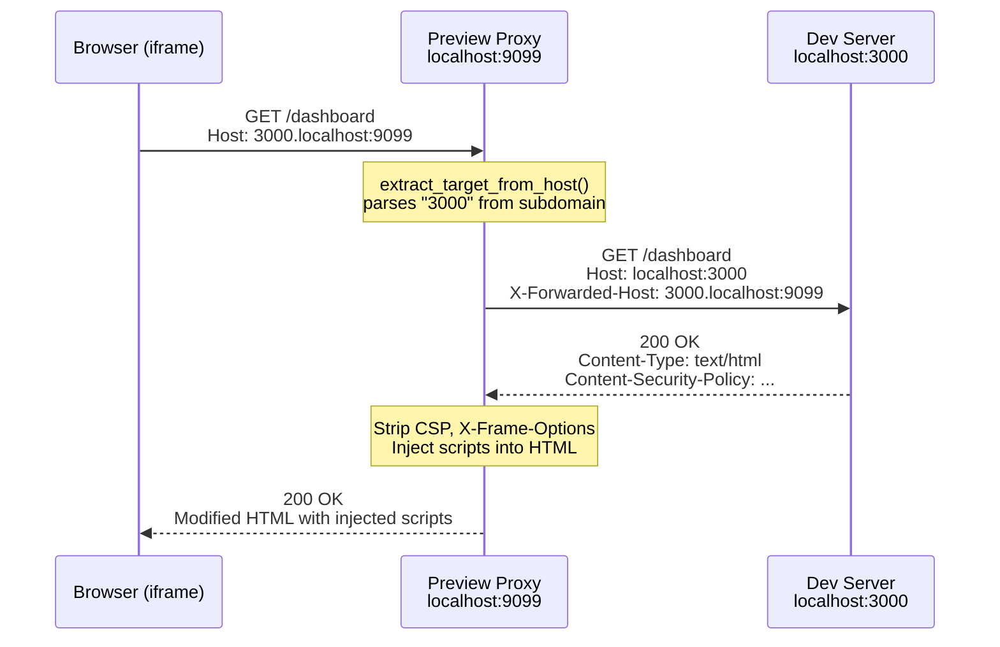
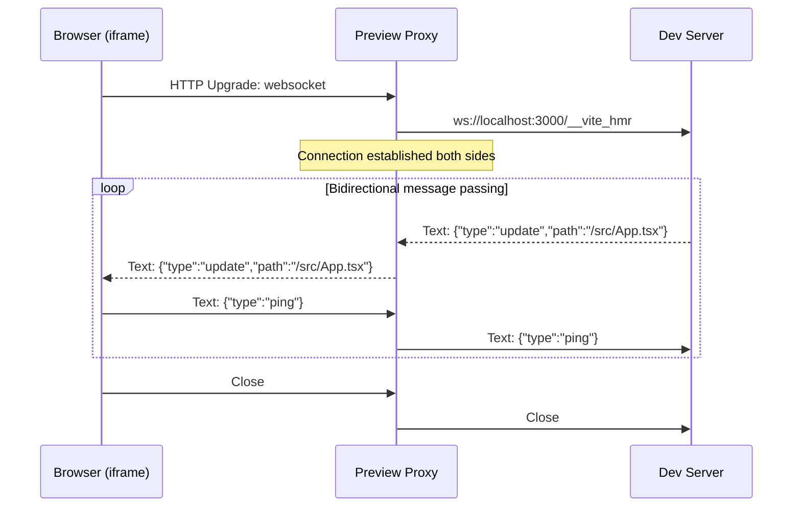
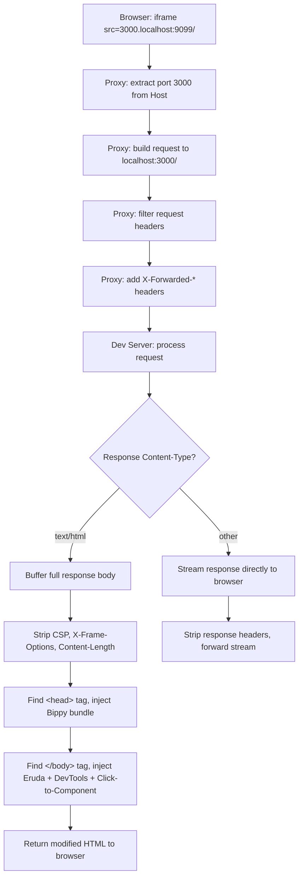
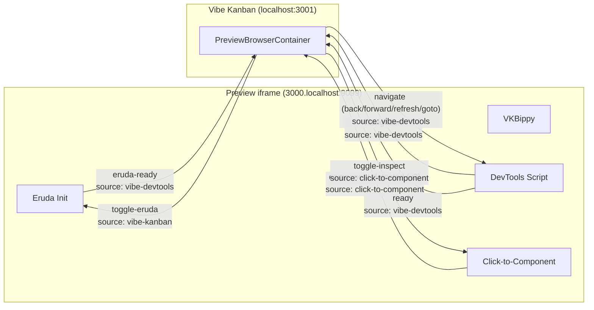

# Preview Proxy Architecture & Script Injection

## Table of Contents

1. [Overview](#1-overview)
2. [Subdomain-Based Port Routing](#2-subdomain-based-port-routing)
3. [Request Proxying Details](#3-request-proxying-details)
4. [Script Injection](#4-script-injection)
5. [WebSocket Proxying](#5-websocket-proxying)
6. [Content-Length Handling](#6-content-length-handling)
7. [Architecture Diagram](#7-architecture-diagram)
8. [File References](#8-file-references)

---

## 1. Overview

Vibe Kanban includes a built-in preview browser that lets users see their dev server output directly inside the application. The user's React, Vue, Svelte, or Astro app renders in an iframe alongside the Kanban board, task lists, and agent controls. This creates a tight feedback loop: an AI coding agent makes changes, the dev server hot-reloads, and the user sees the result without switching windows.

The **Preview Proxy** is the piece that makes this work safely and extensibly. It's a separate Axum HTTP server running on its own port, completely independent from the main Vibe Kanban backend. Every request the preview iframe makes goes through this proxy before reaching the user's dev server.

### Why does the proxy exist?

Three reasons.

**Security isolation.** The preview iframe loads content from a different origin than the main Vibe Kanban app. Browsers enforce the Same-Origin Policy, which means JavaScript running inside the previewed app can't access cookies, localStorage, or DOM elements belonging to Vibe Kanban. Without this isolation, a malicious or buggy dev server could read session tokens, manipulate the Kanban UI, or exfiltrate data. The proxy achieves origin separation by serving preview content from a subdomain like `3000.localhost:9099`, which the browser treats as a completely different origin from `localhost:3001`.

**Header manipulation.** Many dev servers (Next.js, Nuxt, SvelteKit) set `Content-Security-Policy` and `X-Frame-Options` headers that would prevent their content from loading inside an iframe. The proxy strips these headers so the preview works regardless of what the dev server sends.

**Script injection.** The proxy intercepts HTML responses and injects several scripts that power Vibe Kanban's developer tools: React fiber inspection (Bippy), mobile DevTools (Eruda), navigation tracking, and click-to-component detection. These scripts can't be added any other way because the user's dev server is an arbitrary third-party process.

### How it fits together

The main Vibe Kanban backend starts the proxy on a dynamically assigned port during server initialization. That port is stored in a global `OnceLock<u16>` and exposed to the frontend through the config API. The frontend reads this port and constructs iframe URLs that route through the proxy.

---

## 2. Subdomain-Based Port Routing

The proxy uses a subdomain-based scheme to encode the target dev server port directly in the URL. This is the core routing mechanism.

### The flow

```
User's dev server:     http://localhost:3000/dashboard
                              |
                              v
Preview proxy URL:     http://3000.localhost:9099/dashboard
                              |
                              v
Proxy forwards to:     http://localhost:3000/dashboard
```

### Step by step

1. **Frontend constructs the proxy URL.** In `PreviewBrowserContainer.tsx`, the `iframeUrl` memo takes the dev server's URL (e.g., `http://localhost:3000/dashboard`), extracts the port (`3000`), and builds a new URL: `http://3000.localhost:9099/dashboard`. The proxy port (`9099` in this example) comes from the system config API.

2. **Browser sends the request.** The iframe's `src` attribute is set to this proxy URL. The browser sends an HTTP request with `Host: 3000.localhost:9099`.

3. **Proxy extracts the target port.** The `extract_target_from_host()` function parses the `Host` header. It splits on `.`, takes the first segment (`3000`), and parses it as a `u16`. If parsing fails, the proxy returns `400 Bad Request`.

4. **Proxy forwards the request.** The proxy builds a new HTTP request to `http://localhost:3000/dashboard`, copying over the original method, headers (with filtering), and body.

5. **Response flows back.** The dev server's response passes through the proxy, which strips certain headers and (for HTML responses) injects scripts before returning it to the browser.



### Frontend safety checks

The `PreviewBrowserContainer.tsx` component performs three safety checks before constructing the proxy URL:

1. **Same-port guard.** If the dev server port matches Vibe Kanban's own port, the URL is rejected. Proxying to yourself creates an infinite request loop.

2. **Proxy-port guard.** If the dev server port matches the preview proxy port, the URL is also rejected. Same reason.

3. **Hostname warning.** If the browser isn't on `localhost` or `127.0.0.1`, a console warning fires. Subdomain-based routing relies on `*.localhost` resolving to `127.0.0.1`, which only works on localhost.

```typescript
// From PreviewBrowserContainer.tsx (simplified)
const iframeUrl = useMemo(() => {
  const parsed = new URL(effectiveUrl);
  const devServerPort = parsed.port || (parsed.protocol === 'https:' ? '443' : '80');

  // Guard 1: don't proxy to Vibe Kanban's own port
  if (devServerPort === window.location.port || '80') return undefined;

  // Guard 2: don't proxy to the preview proxy port
  if (devServerPort === String(previewProxyPort)) return undefined;

  // Guard 3: warn on non-localhost
  if (!['localhost', '127.0.0.1'].includes(window.location.hostname)) {
    console.warn('Preview proxy subdomain routing may not work on non-localhost');
  }

  const path = parsed.pathname + parsed.search;
  const proxyUrl = new URL(
    `http://${devServerPort}.localhost:${previewProxyPort}${path}`
  );
  proxyUrl.searchParams.set('_refresh', String(previewRefreshKey));
  return proxyUrl.toString();
}, [effectiveUrl, previewProxyPort, previewRefreshKey]);
```

---

## 3. Request Proxying Details

The proxy doesn't just blindly forward bytes. It carefully manages headers, body size, redirects, and content types.

### Request header filtering

The proxy skips these headers when forwarding to the dev server:

| Header | Why it's skipped |
|--------|-----------------|
| `host` | Replaced with the target's host |
| `connection` | Hop-by-hop header, not forwarded |
| `transfer-encoding` | Hop-by-hop, proxy re-encodes |
| `upgrade` | WebSocket upgrades handled separately |
| `proxy-connection` | Non-standard hop-by-hop |
| `keep-alive` | Hop-by-hop |
| `te` | Hop-by-hop |
| `trailer` | Hop-by-hop |
| `sec-websocket-key` | WebSocket handshake, handled separately |
| `sec-websocket-version` | WebSocket handshake |
| `sec-websocket-extensions` | WebSocket handshake |
| `accept-encoding` | Replaced with `identity` to get uncompressed responses |
| `origin` | Stripped to avoid CORS issues on the dev server |

The proxy then adds these headers:

| Header | Value |
|--------|-------|
| `X-Forwarded-Host` | Original `Host` header value (e.g., `3000.localhost:9099`) |
| `X-Forwarded-Proto` | `http` |
| `X-Forwarded-For` | Original `X-Forwarded-For` or `127.0.0.1` |
| `Accept-Encoding` | `identity` (forces uncompressed response for script injection) |

The `Accept-Encoding: identity` header is particularly important. If the dev server returned gzip-compressed HTML, the proxy couldn't inject scripts into it without first decompressing. Requesting `identity` encoding avoids this problem entirely.

### Response header stripping

These headers are removed from the dev server's response before it reaches the browser:

| Header | Why it's stripped |
|--------|------------------|
| `content-security-policy` | Would block injected scripts from executing |
| `content-security-policy-report-only` | Would generate noise in the console |
| `x-frame-options` | Would prevent the iframe from loading the content |
| `x-content-type-options` | Could interfere with script injection |
| `transfer-encoding` | Proxy re-encodes the response |
| `connection` | Hop-by-hop |
| `content-encoding` | Proxy requests `identity`, but strip this just in case |

CSP stripping is the most critical. A Next.js dev server, for example, sets a strict CSP that only allows scripts from its own origin. The injected Eruda CDN script and inline scripts would be blocked without stripping this header.

### Body handling

Request bodies are limited to **50 MB** (`50 * 1024 * 1024` bytes). This is generous enough for file uploads through the previewed app but prevents memory exhaustion from pathological requests.

For responses, the proxy takes two different paths:

- **Non-HTML responses** (images, CSS, JavaScript, JSON, fonts, etc.): The response body is streamed directly from the dev server to the browser. No buffering, no modification. This keeps memory usage low and latency minimal for large assets.

- **HTML responses** (`Content-Type: text/html`): The entire response body is buffered into memory, converted to a UTF-8 string, modified with script injection, and then sent to the browser. This is the only case where the proxy needs to hold the full response in memory.

### Redirect handling

The HTTP client is configured with `redirect(reqwest::redirect::Policy::none())`. The proxy does **not** follow redirects. If the dev server returns a `301`, `302`, or `307`, that redirect response passes through to the browser unchanged. The browser then follows the redirect, which comes back through the proxy again. This preserves the correct URL in the browser's address bar and avoids redirect loops.

---

## 4. Script Injection

When the proxy detects an HTML response (the `Content-Type` header contains `text/html`), it injects scripts at two specific points in the document.

### Injection points

```
<!DOCTYPE html>
<html>
<head>
  <script>{BIPPY_BUNDLE}</script>     <-- Injected immediately after <head>
  <meta charset="utf-8" />
  <title>My App</title>
  <link rel="stylesheet" href="/styles.css" />
</head>
<body>
  <div id="root"></div>
  <script src="/main.js"></script>

  <!-- Injected immediately before </body> -->
  <script src="https://cdn.jsdelivr.net/npm/eruda@3.4.3/eruda.js"></script>
  <script>{ERUDA_INIT}</script>
  <script>{DEVTOOLS_SCRIPT}</script>
  <script>{CLICK_TO_COMPONENT_SCRIPT}</script>
</body>
</html>
```

### Why this order matters

The injection order is not arbitrary. Each script has dependencies that dictate its placement.

**Bippy must load before React.** The Bippy bundle installs a `__REACT_DEVTOOLS_GLOBAL_HOOK__` on the `globalThis` object. React checks for this hook during initialization. If the hook isn't present when React loads, fiber inspection won't work for the lifetime of that page. Placing Bippy right after `<head>` guarantees it runs before any `<script>` tags in the document that might load React.

**Eruda CDN must load before eruda_init.js.** The init script calls `eruda.init()`, which requires the Eruda library to already be available on `window.eruda`. The CDN `<script>` tag is synchronous (no `async` or `defer`), so it blocks until the library is fully loaded.

**Click-to-component depends on VKBippy.** The click-to-component script's React adapter calls `VKBippy.getFiberFromHostInstance()`, `VKBippy.getOwnerStack()`, and other functions from the Bippy bundle. Since Bippy is injected in `<head>` and click-to-component is injected before `</body>`, Bippy is guaranteed to be available.

### Script 1: bippy_bundle.js (React DevTools Hook)

**Placement:** After `<head>`
**Size:** ~14KB minified
**Source:** Bundled from the [bippy](https://github.com/nicholasgasior/bippy) library (v0.5.28)

This script installs a global `VKBippy` object that provides React fiber inspection utilities. It hooks into React's internal DevTools protocol by defining `__REACT_DEVTOOLS_GLOBAL_HOOK__` before React initializes.

Exported functions on `VKBippy`:

| Function | Purpose |
|----------|---------|
| `getFiberFromHostInstance(element)` | Given a DOM element, returns the React fiber node that owns it |
| `getOwnerStack(fiber)` | Returns the component owner stack with source file locations (async, resolves source maps) |
| `traverseFiber(fiber, callback, goUp)` | Walks the fiber tree up or down, calling the callback for each node |
| `isCompositeFiber(fiber)` | Returns true if the fiber represents a user-defined component (not a host element) |
| `getDisplayName(type)` | Extracts the display name from a component type (function name, displayName, etc.) |
| `isInstrumentationActive()` | Returns true if React has connected to the DevTools hook |
| `isSourceFile(fileName)` | Returns true if a file path looks like user source code (not node_modules, not React internals) |
| `normalizeFileName(fileName)` | Strips protocol prefixes, query strings, and webpack/vite loader paths from file names |

The Bippy bundle also includes source map resolution logic. When `getOwnerStack()` encounters a stack frame, it fetches the corresponding `.map` file and resolves the original file name, line number, and column number. This is how Vibe Kanban can show the actual source file path (e.g., `src/components/Button.tsx:42:5`) rather than a bundled path.

### Script 2: eruda_init.js (Mobile DevTools)

**Placement:** Before `</body>`, after Eruda CDN
**Size:** 74 lines
**Communication:** `postMessage` with source `vibe-devtools`

Eruda is a mobile-friendly console/inspector that runs inside the previewed page. The init script:

1. Calls `eruda.init({ defaults: { theme: 'Dark' } })` to start Eruda with a dark theme.
2. Immediately hides Eruda with `eruda.hide()`.
3. Hides the floating entry button by setting `display: none` on the internal `_entryBtn` element.
4. Sends an `eruda-ready` message to the parent window.
5. Listens for commands from the parent window (source: `vibe-kanban`):
   - `toggle-eruda`: Shows Eruda if hidden, hides if shown
   - `show-eruda`: Shows Eruda
   - `hide-eruda`: Hides Eruda

The Vibe Kanban UI has a button that sends `toggle-eruda` commands via `postMessage`. This lets users open a full console/network/elements inspector inside the preview without leaving the app.

### Script 3: devtools_script.js (Navigation Tracking)

**Placement:** Before `</body>`, after eruda_init.js
**Size:** 83 lines
**Communication:** `postMessage` with source `vibe-devtools`

Single-page applications navigate without full page reloads. The browser's iframe doesn't fire `load` events for these navigations, so the parent window has no way to know the current URL. This script solves that by intercepting all navigation methods:

- **`history.pushState`**: Monkey-patched to call `sendNavigation()` after the original.
- **`history.replaceState`**: Same treatment.
- **`popstate` event**: Listened for back/forward button presses.
- **`hashchange` event**: Listened for hash-based routing.

Each navigation event sends a message to the parent:

```javascript
{
  source: 'vibe-devtools',
  type: 'navigation',
  payload: {
    url: location.href,
    title: document.title,
    canGoBack: history.length > 1,
    canGoForward: false,  // can't reliably detect this
    timestamp: Date.now()
  }
}
```

The script also listens for navigation commands from the parent:

| Command | Action |
|---------|--------|
| `back` | `history.back()` |
| `forward` | `history.forward()` |
| `refresh` | `location.reload()` |
| `goto` | `location.href = payload.url` |

This powers the URL bar and back/forward buttons in Vibe Kanban's preview browser chrome.

### Script 4: click_to_component_script.js (Click-to-Component)

**Placement:** Before `</body>`, last injected script
**Size:** 791 lines
**Communication:** `postMessage` with source `click-to-component`

This is the largest and most complex injected script. It implements an "inspect mode" where the user can hover over elements in the preview to see which component rendered them, then click to get detailed component information.

#### Adapter architecture

The script uses an adapter pattern to support multiple frameworks. Each adapter implements:

```javascript
{
  name: string,
  detect: function(element) -> boolean,
  getComponentInfo: function(element) -> Promise<ComponentPayload | null>,
  getOverlayLabel: function(element) -> string | null
}
```

Four framework adapters are registered, plus an HTML fallback:

| Adapter | Detection method | Component info source |
|---------|-----------------|----------------------|
| **Astro** | `element.closest('astro-island')` | Island attributes + inner framework delegation |
| **React** | `VKBippy.isInstrumentationActive()` + `VKBippy.getFiberFromHostInstance(element)` | Fiber tree walking, owner stack with source maps |
| **Vue** | `window.__VUE__` or `el.__VUE__` / `el.__vueParentComponent` markers | Component instance chain (`instance.parent`) |
| **Svelte** | `el.__svelte_meta` on element or ancestors | `__svelte_meta.loc` (file, line, column) |
| **HTML fallback** | Always returns true | Tag name, CSS class, innerHTML preview |

The dispatcher iterates adapters in order: Astro, React, Vue, Svelte. The first adapter where `detect()` returns true gets `getComponentInfo()` called. If that returns null, the HTML fallback is used.

The Astro adapter is special: it detects `<astro-island>` elements and then delegates to the inner framework adapter (React, Vue, or Svelte) based on the `renderer-url` attribute. This means clicking a React component inside an Astro island correctly identifies both the React component and the Astro island wrapper.

#### Overlay UI

When inspect mode is active:

1. A blue overlay (`border: 2px solid #3b82f6`, `background: rgba(59,130,246,0.1)`) follows the mouse cursor, highlighting the element under it.
2. A label above the overlay shows the component name (from the matching adapter's `getOverlayLabel()`).
3. The cursor changes to `crosshair`.
4. All click events are intercepted (`preventDefault`, `stopPropagation`, `stopImmediatePropagation`).

On click, the script:
1. Exits inspect mode immediately (visual feedback).
2. Calls `getElementContext(element)` to run through the adapter chain.
3. Sends the resulting `ComponentPayload` to the parent via `postMessage`.

#### ComponentPayload format (v2 protocol)

```javascript
{
  framework: 'react' | 'vue' | 'svelte' | 'astro' | 'html',
  component: 'Button',           // display name
  tagName: 'button',             // HTML tag (optional)
  file: 'src/components/Button.tsx',  // source file (optional)
  line: 42,                      // line number (optional)
  column: 5,                     // column number (optional)
  cssClass: 'btn-primary',       // first CSS class (optional)
  stack: [                       // component ancestry (optional)
    { name: 'Button', file: 'src/components/Button.tsx:42:5' },
    { name: 'Toolbar', file: 'src/components/Toolbar.tsx:18:3' },
    { name: 'App', file: 'src/App.tsx:7:1' }
  ],
  htmlPreview: '<button class="btn-primary">\n  Click me\n</button>'
}
```

#### Framework detection diagnostic

On page load, the script logs which frameworks it detected:

```
[vk-ctc] Detected frameworks: react, vue
```

This runs `detectFrameworks()`, which checks for Astro islands, VKBippy instrumentation, Vue markers, and Svelte CSS classes.

---

## 5. WebSocket Proxying

Modern dev servers use WebSockets for Hot Module Replacement (HMR). When Vite, webpack-dev-server, or Next.js detect a file change, they push an update to the browser over a WebSocket connection. The proxy must handle these connections too, or HMR breaks.

### How it works

1. The proxy detects a WebSocket upgrade request by checking for `WebSocketUpgrade` in the Axum request parts.
2. It accepts the upgrade on the client side (browser to proxy).
3. It opens a new WebSocket connection to the dev server: `ws://localhost:{targetPort}/{path}`.
4. It spawns two async tasks to bridge the connection bidirectionally.



### Message type handling

The proxy translates between Axum's WebSocket message types and tokio-tungstenite's types:

| Frame type | Handling |
|-----------|----------|
| **Text** | Forwarded as-is |
| **Binary** | Forwarded as-is |
| **Ping** | Forwarded (keeps connection alive) |
| **Pong** | Forwarded |
| **Close** | Forwarded with close code and reason, then connection terminates |
| **Frame** (raw) | Skipped (tungstenite internal) |

### Concurrency model

The two forwarding tasks (client-to-dev and dev-to-client) run as separate `tokio::spawn` tasks. A `tokio::select!` monitors both. When either direction completes (due to a close frame or error), the `select!` returns and the proxy logs which direction finished first. The other task is implicitly dropped, closing its half of the connection.

This design handles the common case where the dev server restarts (HMR reconnect): the dev-to-client task sees the connection close, `select!` fires, and the browser-side connection is cleaned up. The browser's HMR client then reconnects automatically.

---

## 6. Content-Length Handling

When the proxy injects scripts into an HTML response, the response body grows. A `Content-Length` header from the dev server would now be wrong, telling the browser to expect fewer bytes than the proxy actually sends. This causes truncated responses.

The proxy handles this by **stripping the `Content-Length` header from HTML responses**:

```rust
if is_html && name_lower == "content-length" {
    continue;
}
```

For non-HTML responses, `Content-Length` is preserved because the body isn't modified.

Without an explicit `Content-Length`, HTTP/1.1 allows the server to signal the end of the response by closing the connection (for non-chunked responses) or using chunked transfer encoding. Axum's response builder handles this automatically, typically using chunked encoding.

This is a deliberate trade-off: slightly less efficient transfer (no upfront size hint) in exchange for correct behavior. Since preview content is served over localhost, the performance impact is negligible.

---

## 7. Architecture Diagram

```
+---------------------------------------------------------------+
|                         BROWSER                                |
|                                                                |
|  +------------------------+   +------------------------------+ |
|  |   Vibe Kanban App      |   |   Preview iframe             | |
|  |   localhost:3001       |   |   3000.localhost:9099        | |
|  |                        |   |                              | |
|  |   PreviewBrowser       |<--|   Injected Scripts:          | |
|  |   Container            |   |   - VKBippy (React hook)    | |
|  |                        |   |   - Eruda (DevTools)        | |
|  |   postMessage <--------+---|   - DevTools (navigation)   | |
|  |                        |   |   - Click-to-Component      | |
|  +------------------------+   +------------------------------+ |
|                                        |                       |
+----------------------------------------|-----------------------+
                                         | HTTP / WebSocket
                                         v
                             +-----------------------+
                             |    Preview Proxy      |
                             |    localhost:9099      |
                             |                       |
                             |  1. Parse subdomain   |
                             |     (Host header)     |
                             |  2. Filter headers    |
                             |     (strip CSP, etc.) |
                             |  3. Forward request   |
                             |     to dev server     |
                             |  4. Inject scripts    |
                             |     (HTML only)       |
                             |  5. Bridge WebSocket  |
                             |     (HMR support)     |
                             +-----------+-----------+
                                         |
                                         v
                             +-----------------------+
                             |    Dev Server         |
                             |    localhost:3000      |
                             |    (React/Vue/etc.)   |
                             +-----------------------+
```

### Data flow for an HTML page load



### postMessage communication map



---

## 8. File References

| File | Lines | Description |
|------|-------|-------------|
| `crates/server/src/preview_proxy/mod.rs` | 407 | The proxy server. Axum router, subdomain extraction, HTTP proxying, WebSocket bridging, HTML detection, script injection orchestration. |
| `crates/server/src/preview_proxy/bippy_bundle.js` | ~14KB | Minified Bippy library (v0.5.28). Installs `VKBippy` global with React fiber inspection: `getFiberFromHostInstance`, `getOwnerStack`, `traverseFiber`, `isCompositeFiber`, `getDisplayName`, `isInstrumentationActive`, `isSourceFile`, `normalizeFileName`. Includes source map resolution. |
| `crates/server/src/preview_proxy/eruda_init.js` | 74 | Initializes Eruda mobile DevTools with dark theme. Hides the floating entry button. Listens for show/hide/toggle commands from the parent window via `postMessage`. Sends `eruda-ready` signal when initialized. |
| `crates/server/src/preview_proxy/devtools_script.js` | 83 | Navigation tracking. Monkey-patches `history.pushState` and `history.replaceState`, listens for `popstate` and `hashchange`. Sends navigation events to parent. Receives navigation commands (back, forward, refresh, goto). |
| `crates/server/src/preview_proxy/click_to_component_script.js` | 791 | Click-to-component system. Adapter architecture supporting React, Vue, Svelte, and Astro. Blue overlay UI with component name labels. Framework detection diagnostic. Sends `component-detected` payloads (v2 protocol) with component name, file path, line/column, stack trace, and HTML preview. |
| `frontend/src/components/ui-new/containers/PreviewBrowserContainer.tsx` | ~600+ | Frontend component that constructs proxy URLs, manages the iframe, handles `postMessage` events from injected scripts, and provides the preview browser chrome (URL bar, back/forward buttons, refresh, screen size controls). |
