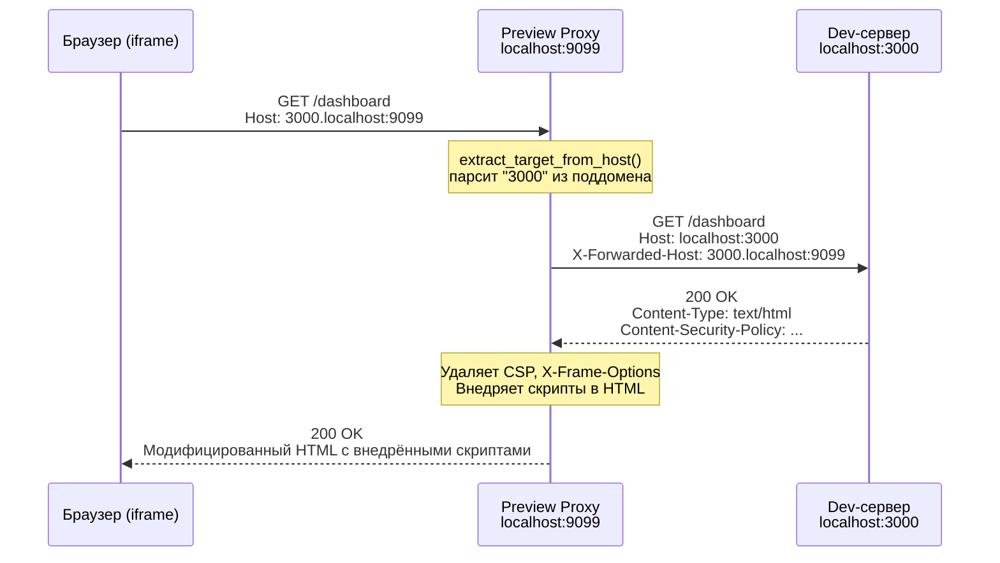
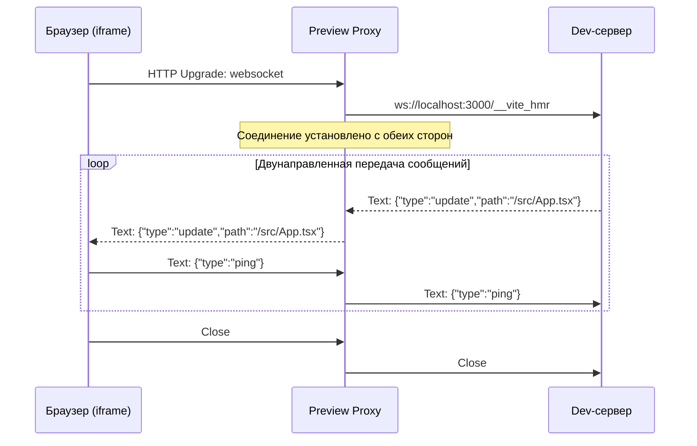
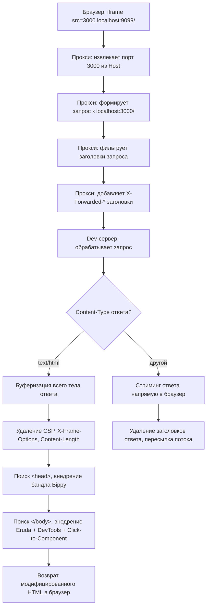
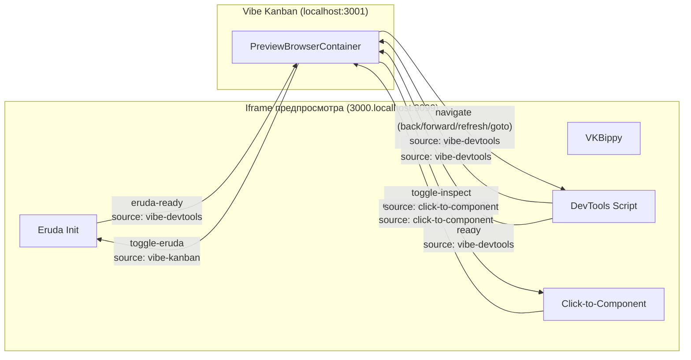

# Архитектура Preview Proxy и система инъекции скриптов

## Содержание

1. [Обзор](#1-обзор)
2. [Маршрутизация по поддоменам](#2-маршрутизация-по-поддоменам)
3. [Детали проксирования запросов](#3-детали-проксирования-запросов)
4. [Инъекция скриптов](#4-инъекция-скриптов)
5. [Проксирование WebSocket](#5-проксирование-websocket)
6. [Обработка Content-Length](#6-обработка-content-length)
7. [Архитектурная диаграмма](#7-архитектурная-диаграмма)
8. [Справочник по файлам](#8-справочник-по-файлам)

---

## 1. Обзор

В Vibe Kanban есть встроенный браузер предпросмотра. Пользователь видит результат работы своего dev-сервера прямо внутри приложения, в iframe рядом с канбан-доской, списками задач и панелью управления агентами. AI-агент вносит изменения в код, dev-сервер перезагружается через HMR, и пользователь сразу видит результат, не переключаясь между окнами.

**Preview Proxy** обеспечивает работу этого механизма. Это отдельный HTTP-сервер на базе Axum, запущенный на собственном порту, полностью независимый от основного бэкенда Vibe Kanban. Каждый запрос из iframe предпросмотра проходит через этот прокси, прежде чем попасть на dev-сервер пользователя.

### Зачем нужен прокси?

Три причины.

**Изоляция безопасности.** Iframe предпросмотра загружает контент с другого origin, отличного от основного приложения Vibe Kanban. Браузеры применяют Same-Origin Policy: JavaScript внутри предпросматриваемого приложения не может получить доступ к cookies, localStorage или DOM-элементам Vibe Kanban. Без такой изоляции вредоносный или некорректно работающий dev-сервер мог бы прочитать токены сессии, манипулировать интерфейсом канбан-доски или похитить данные. Прокси обеспечивает разделение origin, обслуживая контент предпросмотра с поддомена вроде `3000.localhost:9099`, который браузер считает совершенно другим origin по сравнению с `localhost:3001`.

**Манипуляция заголовками.** Многие dev-серверы (Next.js, Nuxt, SvelteKit) устанавливают заголовки `Content-Security-Policy` и `X-Frame-Options`, которые запрещают загрузку их контента внутри iframe. Прокси удаляет эти заголовки, чтобы предпросмотр работал вне зависимости от настроек dev-сервера.

**Инъекция скриптов.** Прокси перехватывает HTML-ответы и внедряет несколько скриптов, обеспечивающих работу инструментов разработчика Vibe Kanban: инспекцию React-файберов (Bippy), мобильные DevTools (Eruda), отслеживание навигации и определение компонентов по клику. Эти скрипты невозможно добавить другим способом, потому что dev-сервер пользователя является произвольным сторонним процессом.

### Как это устроено

Основной бэкенд Vibe Kanban запускает прокси на динамически назначенном порту при старте сервера. Этот порт сохраняется в глобальном `OnceLock<u16>` и передаётся фронтенду через API конфигурации. Фронтенд считывает порт и формирует URL для iframe, направляя запросы через прокси.

---

## 2. Маршрутизация по поддоменам

Прокси использует схему на основе поддоменов, кодируя целевой порт dev-сервера прямо в URL. Это основной механизм маршрутизации.

### Поток данных

```
Dev-сервер пользователя:   http://localhost:3000/dashboard
                                   |
                                   v
URL прокси предпросмотра:  http://3000.localhost:9099/dashboard
                                   |
                                   v
Прокси перенаправляет на:  http://localhost:3000/dashboard
```

### Пошагово

1. **Фронтенд формирует URL прокси.** В `PreviewBrowserContainer.tsx` мемоизированное значение `iframeUrl` берёт URL dev-сервера (например, `http://localhost:3000/dashboard`), извлекает порт (`3000`) и строит новый URL: `http://3000.localhost:9099/dashboard`. Порт прокси (`9099` в этом примере) приходит из API системной конфигурации.

2. **Браузер отправляет запрос.** Атрибут `src` iframe устанавливается в этот URL прокси. Браузер отправляет HTTP-запрос с заголовком `Host: 3000.localhost:9099`.

3. **Прокси извлекает целевой порт.** Функция `extract_target_from_host()` разбирает заголовок `Host`. Она разделяет строку по `.`, берёт первый сегмент (`3000`) и парсит его как `u16`. Если парсинг не удаётся, прокси возвращает `400 Bad Request`.

4. **Прокси перенаправляет запрос.** Прокси формирует новый HTTP-запрос к `http://localhost:3000/dashboard`, копируя метод, заголовки (с фильтрацией) и тело оригинального запроса.

5. **Ответ возвращается обратно.** Ответ dev-сервера проходит через прокси, который удаляет определённые заголовки и (для HTML-ответов) внедряет скрипты перед отправкой в браузер.



### Проверки безопасности на фронтенде

Компонент `PreviewBrowserContainer.tsx` выполняет три проверки перед формированием URL прокси:

1. **Защита от совпадения портов.** Если порт dev-сервера совпадает с портом самого Vibe Kanban, URL отклоняется. Проксирование на самого себя создаёт бесконечный цикл запросов.

2. **Защита от порта прокси.** Если порт dev-сервера совпадает с портом прокси предпросмотра, URL тоже отклоняется. Причина та же.

3. **Предупреждение о hostname.** Если браузер работает не на `localhost` или `127.0.0.1`, выводится предупреждение в консоль. Маршрутизация по поддоменам зависит от того, что `*.localhost` резолвится в `127.0.0.1`, а это работает только на localhost.

```typescript
// Из PreviewBrowserContainer.tsx (упрощённо)
const iframeUrl = useMemo(() => {
  const parsed = new URL(effectiveUrl);
  const devServerPort = parsed.port || (parsed.protocol === 'https:' ? '443' : '80');

  // Проверка 1: не проксировать на порт Vibe Kanban
  if (devServerPort === window.location.port || '80') return undefined;

  // Проверка 2: не проксировать на порт прокси
  if (devServerPort === String(previewProxyPort)) return undefined;

  // Проверка 3: предупреждение для не-localhost
  if (!['localhost', '127.0.0.1'].includes(window.location.hostname)) {
    console.warn('Preview proxy subdomain routing may not work on non-localhost');
  }

  const path = parsed.pathname + parsed.search;
  const proxyUrl = new URL(
    `http://${devServerPort}.localhost:${previewProxyPort}${path}`
  );
  proxyUrl.searchParams.set('_refresh', String(previewRefreshKey));
  return proxyUrl.toString();
}, [effectiveUrl, previewProxyPort, previewRefreshKey]);
```

---

## 3. Детали проксирования запросов

Прокси не просто пересылает байты. Он тщательно управляет заголовками, размером тела, редиректами и типами контента.

### Фильтрация заголовков запроса

Прокси пропускает следующие заголовки при пересылке на dev-сервер:

| Заголовок | Причина пропуска |
|-----------|-----------------|
| `host` | Заменяется на хост целевого сервера |
| `connection` | Hop-by-hop заголовок, не пересылается |
| `transfer-encoding` | Hop-by-hop, прокси перекодирует |
| `upgrade` | WebSocket-апгрейды обрабатываются отдельно |
| `proxy-connection` | Нестандартный hop-by-hop |
| `keep-alive` | Hop-by-hop |
| `te` | Hop-by-hop |
| `trailer` | Hop-by-hop |
| `sec-websocket-key` | Часть WebSocket-рукопожатия, обрабатывается отдельно |
| `sec-websocket-version` | WebSocket-рукопожатие |
| `sec-websocket-extensions` | WebSocket-рукопожатие |
| `accept-encoding` | Заменяется на `identity` для получения несжатых ответов |
| `origin` | Удаляется во избежание проблем с CORS на dev-сервере |

Затем прокси добавляет следующие заголовки:

| Заголовок | Значение |
|-----------|----------|
| `X-Forwarded-Host` | Исходное значение заголовка `Host` (например, `3000.localhost:9099`) |
| `X-Forwarded-Proto` | `http` |
| `X-Forwarded-For` | Исходный `X-Forwarded-For` или `127.0.0.1` |
| `Accept-Encoding` | `identity` (принудительно запрашивает несжатый ответ для инъекции скриптов) |

Заголовок `Accept-Encoding: identity` особенно важен. Если бы dev-сервер вернул HTML, сжатый gzip, прокси не смог бы внедрить скрипты без предварительной распаковки. Запрос кодировки `identity` полностью устраняет эту проблему.

### Удаление заголовков ответа

Следующие заголовки удаляются из ответа dev-сервера перед отправкой в браузер:

| Заголовок | Причина удаления |
|-----------|-----------------|
| `content-security-policy` | Заблокировал бы выполнение внедрённых скриптов |
| `content-security-policy-report-only` | Создавал бы шум в консоли |
| `x-frame-options` | Запретил бы загрузку контента в iframe |
| `x-content-type-options` | Мог бы помешать инъекции скриптов |
| `transfer-encoding` | Прокси перекодирует ответ |
| `connection` | Hop-by-hop |
| `content-encoding` | Прокси запрашивает `identity`, но удаляет на всякий случай |

Удаление CSP критически важно. Dev-сервер Next.js, например, устанавливает строгую CSP, разрешающую скрипты только со своего origin. Внедрённый CDN-скрипт Eruda и inline-скрипты были бы заблокированы без удаления этого заголовка.

### Обработка тела запроса

Тело запроса ограничено **50 МБ** (`50 * 1024 * 1024` байт). Этого достаточно для загрузки файлов через предпросматриваемое приложение, но предотвращает исчерпание памяти при патологических запросах.

Для ответов прокси использует два разных подхода:

- **Не-HTML ответы** (изображения, CSS, JavaScript, JSON, шрифты и т.д.): тело ответа стримится напрямую от dev-сервера в браузер. Без буферизации, без модификации. Это минимизирует потребление памяти и задержки для больших ресурсов.

- **HTML-ответы** (`Content-Type: text/html`): всё тело ответа буферизуется в памяти, конвертируется в строку UTF-8, модифицируется инъекцией скриптов и затем отправляется в браузер. Это единственный случай, когда прокси держит весь ответ в памяти.

### Обработка редиректов

HTTP-клиент настроен с `redirect(reqwest::redirect::Policy::none())`. Прокси **не** следует за редиректами. Если dev-сервер возвращает `301`, `302` или `307`, этот ответ-редирект передаётся в браузер без изменений. Браузер сам следует за редиректом, и новый запрос снова проходит через прокси. Это сохраняет корректный URL в адресной строке и предотвращает циклы редиректов.

---

## 4. Инъекция скриптов

Когда прокси обнаруживает HTML-ответ (заголовок `Content-Type` содержит `text/html`), он внедряет скрипты в двух конкретных точках документа.

### Точки внедрения

```
<!DOCTYPE html>
<html>
<head>
  <script>{BIPPY_BUNDLE}</script>     <-- Внедряется сразу после <head>
  <meta charset="utf-8" />
  <title>Моё приложение</title>
  <link rel="stylesheet" href="/styles.css" />
</head>
<body>
  <div id="root"></div>
  <script src="/main.js"></script>

  <!-- Внедряется непосредственно перед </body> -->
  <script src="https://cdn.jsdelivr.net/npm/eruda@3.4.3/eruda.js"></script>
  <script>{ERUDA_INIT}</script>
  <script>{DEVTOOLS_SCRIPT}</script>
  <script>{CLICK_TO_COMPONENT_SCRIPT}</script>
</body>
</html>
```

### Почему порядок важен

Порядок внедрения не случаен. У каждого скрипта есть зависимости, определяющие его расположение.

**Bippy должен загрузиться до React.** Бандл Bippy устанавливает `__REACT_DEVTOOLS_GLOBAL_HOOK__` на объекте `globalThis`. React проверяет наличие этого хука при инициализации. Если хук отсутствует в момент загрузки React, инспекция файберов не будет работать на протяжении всей жизни страницы. Размещение Bippy сразу после `<head>` гарантирует его выполнение до любых `<script>`-тегов в документе, которые могут загружать React.

**CDN Eruda должен загрузиться до eruda_init.js.** Скрипт инициализации вызывает `eruda.init()`, для чего библиотека Eruda должна быть уже доступна в `window.eruda`. CDN-тег `<script>` является синхронным (без `async` или `defer`), поэтому он блокирует выполнение до полной загрузки библиотеки.

**Click-to-component зависит от VKBippy.** React-адаптер скрипта click-to-component вызывает `VKBippy.getFiberFromHostInstance()`, `VKBippy.getOwnerStack()` и другие функции из бандла Bippy. Поскольку Bippy внедряется в `<head>`, а click-to-component перед `</body>`, доступность Bippy гарантирована.

### Скрипт 1: bippy_bundle.js (хук React DevTools)

**Расположение:** после `<head>`
**Размер:** ~14 КБ (минифицированный)
**Источник:** собран из библиотеки [bippy](https://github.com/nicholasgasior/bippy) (v0.5.28)

Этот скрипт устанавливает глобальный объект `VKBippy`, предоставляющий утилиты для инспекции React-файберов. Он подключается к внутреннему протоколу React DevTools, определяя `__REACT_DEVTOOLS_GLOBAL_HOOK__` до инициализации React.

Экспортируемые функции `VKBippy`:

| Функция | Назначение |
|---------|-----------|
| `getFiberFromHostInstance(element)` | По DOM-элементу возвращает React-файбер, которому он принадлежит |
| `getOwnerStack(fiber)` | Возвращает стек владельцев компонента с расположением исходных файлов (асинхронная, резолвит source maps) |
| `traverseFiber(fiber, callback, goUp)` | Обходит дерево файберов вверх или вниз, вызывая callback для каждого узла |
| `isCompositeFiber(fiber)` | Возвращает true, если файбер представляет пользовательский компонент (не host-элемент) |
| `getDisplayName(type)` | Извлекает отображаемое имя из типа компонента (имя функции, displayName и т.д.) |
| `isInstrumentationActive()` | Возвращает true, если React подключился к хуку DevTools |
| `isSourceFile(fileName)` | Возвращает true, если путь к файлу выглядит как пользовательский исходный код (не node_modules, не внутренности React) |
| `normalizeFileName(fileName)` | Удаляет префиксы протоколов, query-строки и пути загрузчиков webpack/vite из имён файлов |

Бандл Bippy также включает логику разрешения source maps. Когда `getOwnerStack()` встречает фрейм стека, он загружает соответствующий `.map`-файл и определяет оригинальное имя файла, номер строки и столбца. Именно так Vibe Kanban может показать реальный путь к исходному файлу (например, `src/components/Button.tsx:42:5`) вместо пути в бандле.

### Скрипт 2: eruda_init.js (мобильные DevTools)

**Расположение:** перед `</body>`, после CDN Eruda
**Размер:** 74 строки
**Коммуникация:** `postMessage` с source `vibe-devtools`

Eruda предоставляет консоль и инспектор, работающие внутри предпросматриваемой страницы. Скрипт инициализации:

1. Вызывает `eruda.init({ defaults: { theme: 'Dark' } })` для запуска Eruda с тёмной темой.
2. Сразу скрывает Eruda вызовом `eruda.hide()`.
3. Скрывает плавающую кнопку входа, устанавливая `display: none` на внутреннем элементе `_entryBtn`.
4. Отправляет сообщение `eruda-ready` родительскому окну.
5. Слушает команды от родительского окна (source: `vibe-kanban`):
   - `toggle-eruda`: показывает Eruda, если скрыта, скрывает, если показана
   - `show-eruda`: показывает Eruda
   - `hide-eruda`: скрывает Eruda

В интерфейсе Vibe Kanban есть кнопка, отправляющая команды `toggle-eruda` через `postMessage`. Это позволяет пользователям открыть полноценный инспектор консоли/сети/элементов внутри предпросмотра, не покидая приложение.

### Скрипт 3: devtools_script.js (отслеживание навигации)

**Расположение:** перед `</body>`, после eruda_init.js
**Размер:** 83 строки
**Коммуникация:** `postMessage` с source `vibe-devtools`

Одностраничные приложения (SPA) навигируют без полной перезагрузки страницы. Iframe браузера не генерирует события `load` для таких навигаций, поэтому родительское окно не может узнать текущий URL. Этот скрипт решает проблему, перехватывая все методы навигации:

- **`history.pushState`**: monkey-patch, вызывающий `sendNavigation()` после оригинального метода.
- **`history.replaceState`**: аналогичная обработка.
- **Событие `popstate`**: отслеживает нажатия кнопок «назад»/«вперёд».
- **Событие `hashchange`**: отслеживает навигацию на основе хешей.

Каждое событие навигации отправляет сообщение родителю:

```javascript
{
  source: 'vibe-devtools',
  type: 'navigation',
  payload: {
    url: location.href,
    title: document.title,
    canGoBack: history.length > 1,
    canGoForward: false,  // нельзя надёжно определить
    timestamp: Date.now()
  }
}
```

Скрипт также принимает команды навигации от родителя:

| Команда | Действие |
|---------|----------|
| `back` | `history.back()` |
| `forward` | `history.forward()` |
| `refresh` | `location.reload()` |
| `goto` | `location.href = payload.url` |

Это обеспечивает работу адресной строки и кнопок «назад»/«вперёд» в хроме браузера предпросмотра Vibe Kanban.

### Скрипт 4: click_to_component_script.js (определение компонента по клику)

**Расположение:** перед `</body>`, последний внедрённый скрипт
**Размер:** 791 строка
**Коммуникация:** `postMessage` с source `click-to-component`

Это самый большой и сложный из внедряемых скриптов. Он реализует «режим инспекции», в котором пользователь наводит курсор на элементы в предпросмотре, видит, какой компонент их отрендерил, и кликает для получения подробной информации.

#### Архитектура адаптеров

Скрипт использует паттерн адаптеров для поддержки нескольких фреймворков. Каждый адаптер реализует:

```javascript
{
  name: string,
  detect: function(element) -> boolean,
  getComponentInfo: function(element) -> Promise<ComponentPayload | null>,
  getOverlayLabel: function(element) -> string | null
}
```

Зарегистрированы четыре адаптера фреймворков плюс HTML-фоллбэк:

| Адаптер | Метод обнаружения | Источник информации о компоненте |
|---------|------------------|--------------------------------|
| **Astro** | `element.closest('astro-island')` | Атрибуты island + делегирование внутреннему фреймворку |
| **React** | `VKBippy.isInstrumentationActive()` + `VKBippy.getFiberFromHostInstance(element)` | Обход дерева файберов, стек владельцев с source maps |
| **Vue** | `window.__VUE__` или маркеры `el.__VUE__` / `el.__vueParentComponent` | Цепочка экземпляров компонентов (`instance.parent`) |
| **Svelte** | `el.__svelte_meta` на элементе или предках | `__svelte_meta.loc` (файл, строка, столбец) |
| **HTML-фоллбэк** | Всегда возвращает true | Имя тега, CSS-класс, превью innerHTML |

Диспетчер перебирает адаптеры по порядку: Astro, React, Vue, Svelte. Первый адаптер, чей `detect()` вернул true, получает вызов `getComponentInfo()`. Если тот вернул null, используется HTML-фоллбэк.

Адаптер Astro особенный: он обнаруживает элементы `<astro-island>` и затем делегирует внутреннему адаптеру фреймворка (React, Vue или Svelte) на основе атрибута `renderer-url`. Это означает, что клик по React-компоненту внутри Astro-острова корректно идентифицирует и React-компонент, и обёртку Astro-острова.

#### Оверлей

Когда режим инспекции активен:

1. Синий оверлей (`border: 2px solid #3b82f6`, `background: rgba(59,130,246,0.1)`) следует за курсором мыши, подсвечивая элемент под ним.
2. Метка над оверлеем показывает имя компонента (из `getOverlayLabel()` подходящего адаптера).
3. Курсор меняется на `crosshair`.
4. Все события клика перехватываются (`preventDefault`, `stopPropagation`, `stopImmediatePropagation`).

При клике скрипт:
1. Немедленно выходит из режима инспекции (визуальная обратная связь).
2. Вызывает `getElementContext(element)` для прохода по цепочке адаптеров.
3. Отправляет полученный `ComponentPayload` родителю через `postMessage`.

#### Формат ComponentPayload (протокол v2)

```javascript
{
  framework: 'react' | 'vue' | 'svelte' | 'astro' | 'html',
  component: 'Button',           // отображаемое имя
  tagName: 'button',             // HTML-тег (опционально)
  file: 'src/components/Button.tsx',  // исходный файл (опционально)
  line: 42,                      // номер строки (опционально)
  column: 5,                     // номер столбца (опционально)
  cssClass: 'btn-primary',       // первый CSS-класс (опционально)
  stack: [                       // иерархия компонентов (опционально)
    { name: 'Button', file: 'src/components/Button.tsx:42:5' },
    { name: 'Toolbar', file: 'src/components/Toolbar.tsx:18:3' },
    { name: 'App', file: 'src/App.tsx:7:1' }
  ],
  htmlPreview: '<button class="btn-primary">\n  Нажми меня\n</button>'
}
```

#### Диагностика обнаружения фреймворков

При загрузке страницы скрипт логирует обнаруженные фреймворки:

```
[vk-ctc] Detected frameworks: react, vue
```

Функция `detectFrameworks()` проверяет наличие Astro-островов, инструментации VKBippy, маркеров Vue и CSS-классов Svelte.

---

## 5. Проксирование WebSocket

Современные dev-серверы используют WebSocket для Hot Module Replacement (HMR). Когда Vite, webpack-dev-server или Next.js обнаруживают изменение файла, они отправляют обновление в браузер по WebSocket-соединению. Прокси должен обрабатывать и эти соединения, иначе HMR перестанет работать.

### Как это работает

1. Прокси обнаруживает запрос на WebSocket-апгрейд, проверяя наличие `WebSocketUpgrade` в частях запроса Axum.
2. Принимает апгрейд на стороне клиента (браузер к прокси).
3. Открывает новое WebSocket-соединение к dev-серверу: `ws://localhost:{targetPort}/{path}`.
4. Запускает две асинхронные задачи для двунаправленного моста.



### Обработка типов сообщений

Прокси транслирует между типами WebSocket-сообщений Axum и tokio-tungstenite:

| Тип фрейма | Обработка |
|------------|-----------|
| **Text** | Пересылается без изменений |
| **Binary** | Пересылается без изменений |
| **Ping** | Пересылается (поддерживает соединение) |
| **Pong** | Пересылается |
| **Close** | Пересылается с кодом закрытия и причиной, затем соединение завершается |
| **Frame** (сырой) | Пропускается (внутренний формат tungstenite) |

### Модель конкурентности

Две задачи пересылки (клиент-к-серверу и сервер-к-клиенту) запускаются как отдельные задачи `tokio::spawn`. Макрос `tokio::select!` мониторит обе. Когда любое из направлений завершается (из-за фрейма закрытия или ошибки), `select!` возвращает управление, и прокси логирует, какое направление завершилось первым. Другая задача неявно уничтожается, закрывая свою половину соединения.

Такой дизайн корректно обрабатывает типичный случай перезапуска dev-сервера (переподключение HMR): задача сервер-к-клиенту видит закрытие соединения, `select!` срабатывает, и соединение на стороне браузера очищается. HMR-клиент браузера затем автоматически переподключается.

---

## 6. Обработка Content-Length

Когда прокси внедряет скрипты в HTML-ответ, тело ответа увеличивается. Заголовок `Content-Length` от dev-сервера становится некорректным, сообщая браузеру, что нужно ожидать меньше байт, чем прокси фактически отправляет. Это приводит к обрезанным ответам.

Прокси решает это, **удаляя заголовок `Content-Length` из HTML-ответов**:

```rust
if is_html && name_lower == "content-length" {
    continue;
}
```

Для не-HTML ответов `Content-Length` сохраняется, потому что тело не модифицируется.

Без явного `Content-Length` HTTP/1.1 позволяет серверу сигнализировать конец ответа закрытием соединения (для не-chunked ответов) или использованием chunked transfer encoding. Axum автоматически обрабатывает это, обычно применяя chunked-кодирование.

Это осознанный компромисс: чуть менее эффективная передача (нет предварительной подсказки о размере) в обмен на корректное поведение. Поскольку контент предпросмотра передаётся через localhost, влияние на производительность пренебрежимо мало.

---

## 7. Архитектурная диаграмма

```
+---------------------------------------------------------------+
|                         БРАУЗЕР                                |
|                                                                |
|  +------------------------+   +------------------------------+ |
|  |   Приложение           |   |   Iframe предпросмотра       | |
|  |   Vibe Kanban          |   |   3000.localhost:9099        | |
|  |   localhost:3001       |   |                              | |
|  |                        |   |   Внедрённые скрипты:        | |
|  |   PreviewBrowser       |<--|   - VKBippy (хук React)     | |
|  |   Container            |   |   - Eruda (DevTools)        | |
|  |                        |   |   - DevTools (навигация)    | |
|  |   postMessage <--------+---|   - Click-to-Component      | |
|  |                        |   |                              | |
|  +------------------------+   +------------------------------+ |
|                                        |                       |
+----------------------------------------|-----------------------+
                                         | HTTP / WebSocket
                                         v
                             +-----------------------+
                             |    Preview Proxy      |
                             |    localhost:9099      |
                             |                       |
                             |  1. Парсинг поддомена |
                             |     (заголовок Host)  |
                             |  2. Фильтрация        |
                             |     заголовков         |
                             |  3. Пересылка запроса |
                             |     на dev-сервер     |
                             |  4. Инъекция скриптов |
                             |     (только HTML)     |
                             |  5. Мост WebSocket    |
                             |     (поддержка HMR)   |
                             +-----------+-----------+
                                         |
                                         v
                             +-----------------------+
                             |    Dev-сервер         |
                             |    localhost:3000      |
                             |    (React/Vue/и т.д.) |
                             +-----------------------+
```

### Поток данных при загрузке HTML-страницы



### Карта коммуникации через postMessage



---

## 8. Справочник по файлам

| Файл | Строк | Описание |
|------|-------|----------|
| `crates/server/src/preview_proxy/mod.rs` | 407 | Сервер прокси. Роутер Axum, извлечение поддомена, HTTP-проксирование, мост WebSocket, определение HTML, оркестрация инъекции скриптов. |
| `crates/server/src/preview_proxy/bippy_bundle.js` | ~14 КБ | Минифицированная библиотека Bippy (v0.5.28). Устанавливает глобальный `VKBippy` с инспекцией React-файберов: `getFiberFromHostInstance`, `getOwnerStack`, `traverseFiber`, `isCompositeFiber`, `getDisplayName`, `isInstrumentationActive`, `isSourceFile`, `normalizeFileName`. Включает разрешение source maps. |
| `crates/server/src/preview_proxy/eruda_init.js` | 74 | Инициализация мобильных DevTools Eruda с тёмной темой. Скрытие плавающей кнопки. Приём команд show/hide/toggle от родительского окна через `postMessage`. Отправка сигнала `eruda-ready` при инициализации. |
| `crates/server/src/preview_proxy/devtools_script.js` | 83 | Отслеживание навигации. Monkey-patch `history.pushState` и `history.replaceState`, прослушивание `popstate` и `hashchange`. Отправка событий навигации родителю. Приём команд навигации (back, forward, refresh, goto). |
| `crates/server/src/preview_proxy/click_to_component_script.js` | 791 | Система определения компонента по клику. Архитектура адаптеров с поддержкой React, Vue, Svelte и Astro. Синий оверлей с метками имён компонентов. Диагностика обнаружения фреймворков. Отправка payload `component-detected` (протокол v2) с именем компонента, путём к файлу, строкой/столбцом, стеком вызовов и превью HTML. |
| `frontend/src/components/ui-new/containers/PreviewBrowserContainer.tsx` | ~600+ | Фронтенд-компонент, формирующий URL прокси, управляющий iframe, обрабатывающий события `postMessage` от внедрённых скриптов и предоставляющий хром браузера предпросмотра (адресная строка, кнопки «назад»/«вперёд», обновление, управление размером экрана). |
